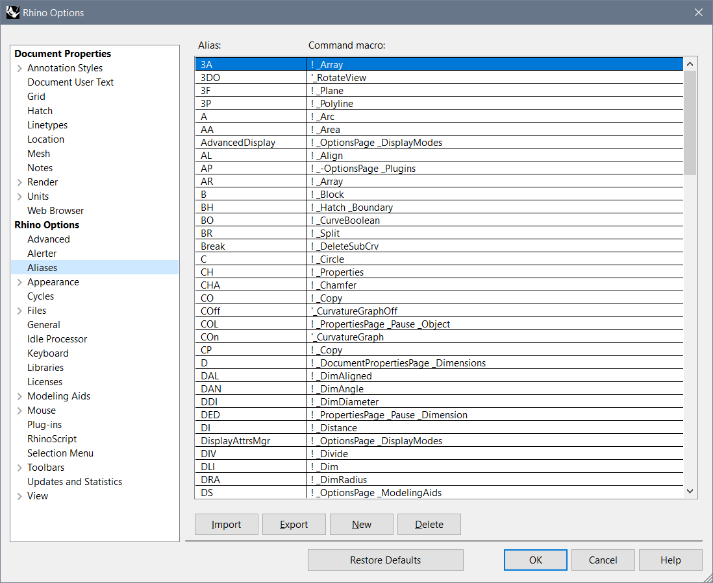

# Getting Started

- [Basic Commands](#basic-rhino-commands)
- [AutoCAD Alias](#autocad-alias-import)

## Basic Rhino Commands

|**Measuring**|  |
|---|---|
|   |   |
| Angle | Report the angle between two picked or defined lines|
| Area | Report an object’s area |
| Distance | Report the distance between two picked locations |
| Volume | Report the volume of closed surfaces, polysurfaces, or meshes |
| -  |
| -  |
| **Organizing** |  |
|   |   |
| Copy | Duplicate objects |
| CopyToLayer | Copy objects to a layer |
| Group | Organize objects into a single component |
| SelAll | Select all objects |
| Sel(...) | Select several object according to selection parameters (Srf, Curve...) |
| SelLast | Select the last changed objects |
| Text | Create annotation text |
| - |
| - |
| **Linear Elements** |  |
|   |   |
| Contour | Create a spaced series of planar curves and points through objects |
| Curve | Draw a curve from control point locations |
| DupBorder | Create a curve or polyline that copies a surface, polysurface, or mesh border |
| ExtractIsocurve | Duplicate surface isoparametric curves |
| ExtractWireframe | Duplicate surface or polysurface edge and isoparametric curves |
| Line | Draw a single line segment |
| Polyline | Draw a multi-segment polyline with options for line and arc segments and close |
| TweenCurves | Create curves between two open or closed input curves |
| Point(s) | Draw a single (multiple) point object |
| - |
| - |
| **Editing General** |   |
|   |   |
| Explode | Break objects down into components |
| ExplodeBlock | Explode a block including any nested blocks into component objects |
| Join | Connect curves, surface edges, or surfaces to form a single object |
| Move | Move objects from one location to another |
| MoveCrv | Move a polycurve/polyline segment |
|MoveEdge | Move a polysurface edge |
| MoveFace | Move a polysurface face |
| Mirror | Create a mirror-image copy of objects |
| PointsOn | Display curve and surface control points |
| PointsOff | Turn off control, edit and solid points display |
| Rebuild | Reconstruct curves, surfaces, and extrusion objects |
| Rotate | Rotate objects around an axis perpendicular to the conststruction plane |
| Rotate3D | Rotate objects around a 3-D axis |
| Scale | Change the size of objects uniformly in the x-, y-, and z-directions |
| Scale1D | Change the size of objects in one direction |
| Scale2D | Change the size of objects uniformly in two directions |
| Split | Divide objects using other objects as cutters |
| Trim | Cut and delete selected portions of an object at the intersection with another object |
| - |
| - |
| **Editing of linear elements** |   |
| | |
| CloseCrv | Close open curves |
| Divide | Create points along a curve by n-th segments or specified length |
| Extend | Lengthen a curve |
| Offset | Copy a curve parallel to the original |
| Project | Project curves/points on a construction plane / surface |

# AutoCAD Alias Import

If you're an expert of AutoCAD, there's a way to import AutoCAD Aliases into Rhino. You can then use the keyboard shortcuts to speed up your modeling process.

Steps:

1. Download the alias file here: [autocad-alias](./doc/AutoCAD_alias_for_Rhino.txt)

2. Select from Menu: Tools->Options->Aliases:

   

3. Click "Import" and load the downloaded file.

4. Confirm with any warning of "overwritten the current aliases".
