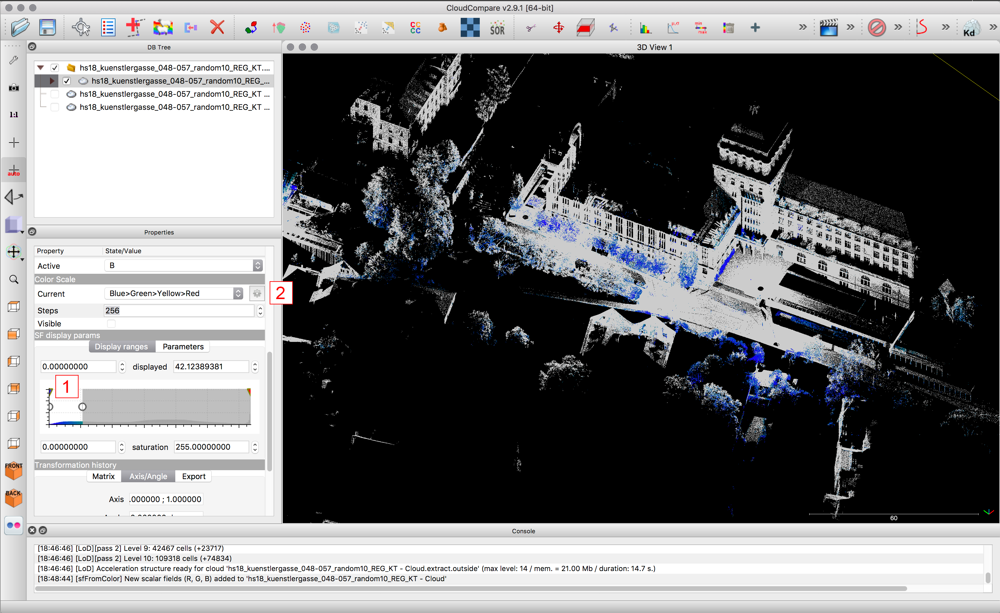

# CloudCompare

## Content
*Just jump to the topic you are looking for*

- [Environment](#environment)
- [Import Files](#import-files)
- [Navigation](#navigation)
- [Display options and Background Color](#display-options-and-background-color)
- [DB Tree](#db-tree)
- [Viewing Tools](#viewing-tools)
- [Properties](#properties)
- [Saving Files and Projects](#saving-files-and-projects)
- [Clone Tool](#clone-tool)
- [Merge Tool](#merge-tool)
- [Segmentation Tool](#segmentation-tool)
- [Section Tool](#section-tool)
- [Subsampling Tool](#subsampling-tool)
- [Simple Color Manipulation](#simple-color-manipulation)
- [Point Source ID](#point-source-id)
- [Color Manipulation via "Scalar Field" and "Filter by Value"](#color-manipulation-via-scalar-field-and-filter-by-value)
- [Registration](#registration)
- [Manual Positioning, Translate, Rotate](#manual-positioning-translating-and-rotating)
- [Create and Save Viewpoint](#create-and-save-viewpoint)
- [Render Images](#render-images)

---

## Environment

>1. DB Tree:            
>Overview of all pointclouds and objects in the file. Clouds can be activated and ticked "visible" or "invisible."
>
>
>2. Properties:       
>Each cloud has properties such as colour, number of points, location, scalar field, etc.
>
>
>3. Console:          
>Gives you an insight in the program's calculations in the background or tells you when errors occure.
>
>
>4. Viewport:   
>The pointclouds are visible here. Each one can be ticked "visible" or "invisible."
>
>
>5. Toolbar:    
>Where the main editing tools - like multiplying, cloning, registering etc. - can be found.
>
>
>6. Viewing Toolbar:    
>Where the view and navigation can be set.

---

## Import Files

>**Drag and drop a pointcloud file into the viewport** or open it under ***>file/open*** or ***Ctr-O***
>
>When using *file/open*: Make sure to set the file type to "all".
>(CloudCopare can import a great variety of file types .txt, .xyz, .pts, .las, .laz, ...)

### Import Files (Setting)

 

>Depending on the file format you will be asked to structure the imported data.
>(.txt, .xyz, .pts, ... not .las, .laz)
>
>The first three columns are the X-, Y- and Z-axis followed by the R-, G-, B-Values and the scalar field. More columns containing for example values concerning point_source_id, scanner_id or others can follow.
>
>In the Case of **.pts files** the order of the columns **X-Y-Z-R-G-B-Scalar** needs to be changed into **X-Y-Z-Scalar-R-G-B**. (as shown in the screen shot)
>
>**.xyz** and **.txt** are less predictable. Mostly the order is X-Y-Z but some programs use Y for height instead of Z. Keep in mind while arranging the columns that the R-G-B Values have the same format and are between 0-255, the X-Y-Z have the same format too and can be very high (when registered to a coordinate system) or detailed numbers.
>
>**You can apply these settings "to all" or to only one imported cloud. It's recommended to test the settings with one file and then in a second step apply it to all other files.**

### Import Files (Setting, Global Shift)

>After clarifying the structure of the file, the window with the **global shift** appears. (this only appears if your cloud is "too far" from the origin, which is the case for most officially registered pointclouds which are in case of Switerland referenced to the Swiss Grid or CH1903+ oordinate system.
>
>Make sure you click "yes" or "yes to all" to avoid display difficulties. If you click "yes to all" all next imports will be shifted by the same global shift. Keep that in mind if you want to combine files with different global shifts.
>Recommended **global shift: X:-2684000 Y:-1249000 Z: 0** for files from the canton of Zurich ("REG-KT" = registered to the cantonal model which equals the Swiss Coordinate System).
>
>Make sure not to open files with different global shifts, as they will not match anymore!
>Therefore it might make sense to write down the first global shift you apply to the first imported cloud in a separate .txt file and save it with the CloudCompare file.
>
>Scans are shifted globally to decrease the size of the coordinates. *Since the files are registered in the Swiss Coordinate System their X and Y Values are above 1'000'000 and 2'000'000, Z values are equal to the height above sea-level. As computing coordinates with a lot less ditis reducing these numbers is especially helpful for displaying pointclouds. In the process CloudCompare sets a new imaginary starting point 0/0/0 and displays your import next to it. However the cloud is not really moved to this new orgigin - just temporarily shifted. Once saved the cloud is on default saved with its original coordinates unless stated otherwise in the cloud properties tab.
>
>After opening a file the global shift can be edited under:
>***>file/edit global shift***

---

## Navigation

>1. Moving around:   
>Right click and hold to pan the view. Left click and hold to rotate the view, click close to the displayed circles to rotate the view in the respective axis. Navigation is easier when in perspective mode (see 4)
>
>
>2. Center of Rotation:   
>With this button you set the center of rotation within your model.
>
>
>3. Auto Center of Rotation:  
>While having this ON, the program always tries to find the ideal center of rotation.
>
>
>4. View setup:         
>Orthogonal view will generate a parallel projection along the X,Y or Z axis (top view, front view, sections etc.) Object-centered perspective or viewer centered perspective generate more realistic renderings.
>
>
>5. Projection type:    
>Front view, top view, ...
>
>
>6. Global zoom:        
>If you want to see the full model or got lost; use this button to fit all currently visible pointclouds into your active viewport.

---

## Display options and Background Color

>**1. Settings** or >**Display / Display Options / Colors and Materials**
>
>
>Open the chapter "Colors and Materials": on the right side you can change the background color (plain black, white or gray backgrounds usually work best). The default gradient in the background can be turned off by unticking the respective box.

---

## DB Tree

>1. The DB-Tree on the left side shows the structure of the file.
>
>
>**CloudCompare files can easily get very complex. Keep you files structured to be able to return to the project without losing too much time.**
>(Each action e.g. duplicate, section, cut, segment will create a new/modified Cloud, it is important to keep an overview.)
>
>
>Pointclouds and other objects can be renamed and grouped. Make use of this function early on.
>- to rename double left-click on the name
>- use drag and drop to move objects, groups or pointclouds into folders

---

## Viewing Tools

>The viewing toolbar is on the left.
>
>
>1. View setup:
>- Orthographic mode: for orthographic sections, top view, etc.
>
>- Object centered view or viewer centered view: for perspective images
>
>
>2. Can be used to adjust the camera/view numerically (to be sure it’s precise and strait)
>
>
>3. Shortcuts to the top view, front, side, ...

---

## Properties

>By clicking on a pointcloud in your DB Tree you will see it’s properties below.
>**Be aware the properties box is often too small to be completely displayed on the screen; there is a lot to discover when you scroll down!**
>
>
>1. Name
>
>2. Visibility
>
>3. Visibility of the name
>
>4. Show color or scalar field (which can be the intensity or point_source_id or ...)
>
>5. Number or points
>
>6. Point size
>
>7. Scalar field (if there is more than one, it can be changed here)
>
>8. Settings for the scalar field
>
>9. Transformation history (past transformations on the cloud are visible)

---

## Saving Files and Projects

>**Very important: Save your project regularly! (Manually)**
>Cloud Compare does not automatically save your project. Ever. In combination with the missing funtion of "undo" or "Ctr+Z" regular saving becomes even more important.
>
>
>1. While having a Cloud activated you can save that Cloud by pressing
>
>2. **Save** or ***Command-S*** or >***file/save***
>
>
>Point Clouds are best saved in .laz file, which is a compression format (rather small) without loss of quality (number or points or color information) or directly as a .bin format - the native CloudCompare format, which has the best performance for saving and re-opening.
>
>
>**To Save a Project** you have to **activate/select all Clouds and Folders in the DB Tree** and save as **.bin -file.** This will save the complete folder structure of the file.

---

## Clone Tool

>**1. Clone the Sheep**    
>Activate one or more clouds and press the clone icon.
>
>
>You will get every activated cloud added to the DB-Tree as **example - cloud.clone** at the bottom of all of your clouds.
>
>Alternatively click >***Edit/Clone***

---

## Merge Tool

>**1. Merge Tool**    
>Activate two or more clouds and press the merge icon.
>
>
>Be aware there is no "Ctr+Z" or "undo" in Cloud Compare; once Clouds are merged you can only with some difficulties split them (via point_source_id).
>
>
>Alternatively click >***Edit/Merge***
>
>
>***When asked to save the different clouds***

---

## Segmentation Tool

>**1. Segmentation Tool**    
>Activate one or more clouds and press the Segmentation Tool.
>
>
>A small toolbar will appear on the upper right side.   
>2. Pause (allows you to navigate normally without marking a segmentation-path)
>3. Polygon mode or rectangle mode.
>
>
>By clicking left you can create an area to be segmented, by clicking the right mouse button the polygon is being closed. To cut correct sections use the appropriate viewport for the job in orthogonal mode.
>
>
>4. All points inside the segment will be kept.
>5. All points outside the segment will be kept.
>
>
>6. Refresh: All temporary segmentation will be cleared, but you can continue segmenting.
>7. All temporary segmentations will be processed and saved as clouds.
>8. All temporary segmentations will be processed but **only the visible saved**.
>9. Cancel, no segmentations will be processed, the segmentation mode is closed.

---

## Section Tool

>**1. Section Tool**    
>Activate one or more clouds and press the section tool.
>
>
>The outlines of the cloud(s) will get arrows which can be moved (with the arrow) and turned (with the wheel around the arrow) in order to create sections.
>
>
>2. Will create a new cloud of all points inside the bounding box.
>3. Will create several clouds of a) the points inside; b) the points in front; c) the points behind; d) the point above; e). ... according to the settings that are chosen.
>
>
>4. Allows you to quickly change the view (top view, right view, etc.)

---

## Subsampling Tool

>**1. Subsampling Tool**    
>Activate one or more clouds and click at the subsampling tool.
>
>
>2. Method:
**Space:** defines the minimal allowed space between two points. It will delete points where there are closes to each other than the set minimum.
>
>
>**Random:** randomly deletes a set amount of points (regardless if they are close to each other or not).
>
>
>**Octree:** will create a grid of boxes (the size of which can be defined) in which all other points than one will be deleted. (it has the same effect as space, but the result will be a grid of points)
>
>
>3. Set the number of points you want to keep / subsample.

---

## Simple Color Manipulation

>***>Edit/Color***    
>Activate one or more clouds and go to ***>Edit/Color***.
>
>1. Set unique: Allows to colour all points with one colour.
>2. Height Ramp: Colour the points according to their height.
>3. Convert your clouds to gray scale.
>4. Convert to scalar field (will be explained under [Color Manipulation via Scalar Field and filter by Value](#color-manipulation-via-scalar-field-and-filter-by-value))

---

## Point Source ID

>**>Properties/RGB-Scalar Field** (change to Scalar Field)    
>
>
>1. Scroll down to scalar fields (SF)/**Active: Point Source ID**.
>
>
>(Each scan has a number = point source ID by which the different groups of scans can be separated / filtered)
>
>
>2. Scroll down to SF display parameters: select the one you need.

### Point Source ID, filter by value

>***>Edit/Scalar Fields/Filter by Value***       
>
>
>Choose filter by Value to segment the Cloud into two Clouds: A) the Cloud with the Point Source ID you filtered and B) the Rest.
>
>
>Now you can separately tread the group and the single scans in terms of subsampling,
segmenting, coloring etc.

---

## Color Manipulation via Scalar Field and Filter by Value

>
>***>Edit/Colors/Convert to Scalar Field***   
Activate one or more clouds and go to >Edit/Colors/Convert to scalar field.
>
>
>Converting the RGB values into a scalar field allows to later **Filter by Value**. Meaning in this case "Filter by Color". This way you can separate one color from the rest of the cloud. e.g. all white or all green points.

>Be aware that visually you will get rid of maybe unpleasant color irritations, but you will also lose the geometric information of the points.

>Similar to "Filter by Value" for the point source ID you can now filter the clouds by value/color "1"|
>
>
>Although this new scalar field is shown in a spectrum from *Blue>Green>Yellow>Red* it resembles the true RGB values of the point.
>
>
>In the example shown all white points are selected (shown in blue).

>*How a scalar field is represented can be chosen under Properties/Color Scale/Current (there are may default options but also the possibility to customize them)*

---

## Registration

>1. Registration Tool   
>Activate two clouds and press the registration tool to register one cloud onto the other and amke them match up.
>
>
>2. It is important to correctly select which cloud will be **aligned** and which one will be the **reference cloud** – the **aligned** one will be moved whereas the reference cloud stays in position.
>
>
>on the upper right side a window will open:
>3. Select at least three point pairs and check the deviation distance
>4. Press align
>5. (the difference should be as small as possible – within milimeter range)
This process can be repeated and improved as many times as necessary.
>
>
>6. Once the alignment is satisfying press the green check bottom.
>7. Can be pressed to cancel the registration process.
>
>
>8. The rotation can be set to **Z only**, since all scans are ideally already leveled out by the scanner in the field. Also **untick "adjust scale"** since laser scans are in 1:1. (Exception: Clouds created with photogrammetry are neither leveled nor scaled!)

---

## Manual Positioning Translating and Rotating

>1. Translate and Rotate Tool   
>Activate one or more clouds and press the "Translate and Rotate Tool" to manually position them.
>
>
>Navigation: A right click will move the cloud(s) – A left click will rotate them.
>
>
>On the upper right side a window will open:
>2. Pause: Allows you to navigate without translating, moving or rotating the selected clouds.
>3. Allows clouds to only be rotated around one axis or translated in one or two directions.
>4. Permanently saves the changes.
>5. Cancel the whole process without any changes being saved.

---

## Create and Save Viewpoint

>***> Display/Save Viewport as Object or Command-V***   
>
>
>When rendering it is important to save viewports to be able to return to or redo a rendering at a later point. (described on [Render Images](#render-images)).
>
>
>Please give your viewport a name other than the default "Nr. 1".

---

## Render Images

>***Display/Render to file***   
>
>
>For "Rendering" CloudCompare is basically taking a screenshot of the viewport – but in a n-times higher resolution than the screen itself.
>
>
>Settings:    
>1. The target folder to save the render can be set.
>2. The rendering resolution as a n-times resultion of the screen
>
>
>Important: tick "**don’t scale features**"
>
>
>In addition to adjusting the resolution, the point size can also be manipulated. It is recommended to start with the smallest/default and only enlarge the points if necessary. (this can be set in the Properties of each cloud)
>
>
>3. Keep in mind the viewport can be moved very precisely with the camera settings.
>4. Do not forget to set the projection (orthogonal or perspective) you desire.   
>Also be aware not to have any clouds selected, since the yellow selection frame will be rendered.
