# Photogrammetry Tutorial

Photogrammetry is the science and technology of obtaining reliable information about physical objects and the environment through the process of recording, measuring and interpreting photographic images and patterns of electromagnetic radiant imagery and other phenomena [wikipedia]. This tutorial will cover the basic steps of obtaining a Digital Terrian Model (DTM) from orthographic images aquired by a consumer quadcopter (without ground control points). 

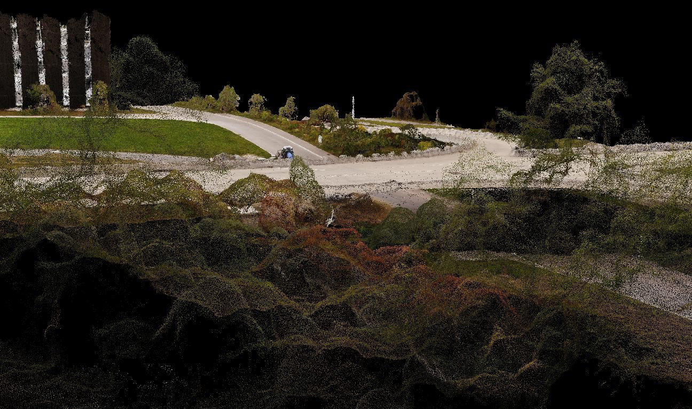

#### Getting Started

- [Part 1 Image Aquisition](#part-1-image-aquisition)
- [Part 2 Image Processing](#part-2-image-processing)
- [Part 3 Exporting Data](#part-3-exporting-data)

#### Links

- Flight mission App: [Pix4D Capture](https://www.pix4d.com/product/pix4dcapture)
- Data Processsing App: [Agisoft Metashape](https://www.agisoft.com/)
- Regulations and general questions relating to drones: [Federal Office of Civic Aviation (BAZL)](https://www.bazl.admin.ch/bazl/en/home/good-to-know/drones-and-aircraft-models/allgemeine-fragen-zu-drohnen.html)
- Drone Regulations for Switzerland: [Swiss federation of civile drones (SFCD)](https://www.drohnenverband.ch/)
- No-fly Zones in Switzerland: [BAZL-MAP](https://map.geo.admin.ch/?lang=en&topic=ech&bgLayer=ch.swisstopo.pixelkarte-farbe&layers=ch.swisstopo.zeitreihen,ch.bfs.gebaeude_wohnungs_register,ch.bav.haltestellen-oev,ch.swisstopo.swisstlm3d-wanderwege,ch.bazl.einschraenkungen-drohnen&layers_visibility=false,false,false,false,true&layers_timestamp=18641231,,,,&layers_opacity=1,1,1,1,0.6)

#### Other Advanced Tutorials

- **Agisoft Metascape** / [Aerial data processing (with Ground Control Points)](https://agisoft.freshdesk.com/support/solutions/articles/31000153696)
- **Pix4D Mapper** / [How to import and mark ground control points](https://support.pix4d.com/hc/en-us/articles/360000276046-How-to-import-and-mark-ground-control-points-GCPs)
- **Autodesk ReCap Photo** / [How to set GCP (Ground Control Points) and Coordinate System with Autodesk ReCap Photo](https://knowledge.autodesk.com/support/recap/learn-explore/caas/video/youtube/watch-v-u2A89YLaVP0.html)

---

## Part 1: Image Aquisition

We will aquire the images using a consumer quadcopter and the Pix4D Capture App. Make sure you are aware of all up-to-date regulations regarding your flight-location and flight-mission using the links above. Before you fly a drone yourself, please review the following check-list that applies only for Switzerland, until 12.12.2020:

* I know and comply with the law.
* I have complete control of my drone.
* I respect other people's privacy.
* I am not a danger to people or animals.
* I do not fly in nature reserves.
* I check with the local authorities abaut any flying restriction.
* I avoid other aircraft in good time.
* I am properly insured.
* I don't fly more than 150 meters in control zones.
* I don't fly near emergency services are working.
* I don't fly over or near 100 m of crowds.
* I never fly without a visual.
* The drone doesn't weigh more than 30 kg.

There are many apps that can do waypoint-missions for DJI (or other) drones like [Pix4D Capture](https://www.pix4d.com/product/pix4dcapture), [DroneDeploy](https://www.dronedeploy.com/), [QGroundControl](http://qgroundcontrol.com/), [Litchi](https://flylitchi.com/), etc. Be aware that not all drones are supported, and check  compatibility before borrowing or buying a drone for aerial surveys. We will use Pix4D to capture the images.

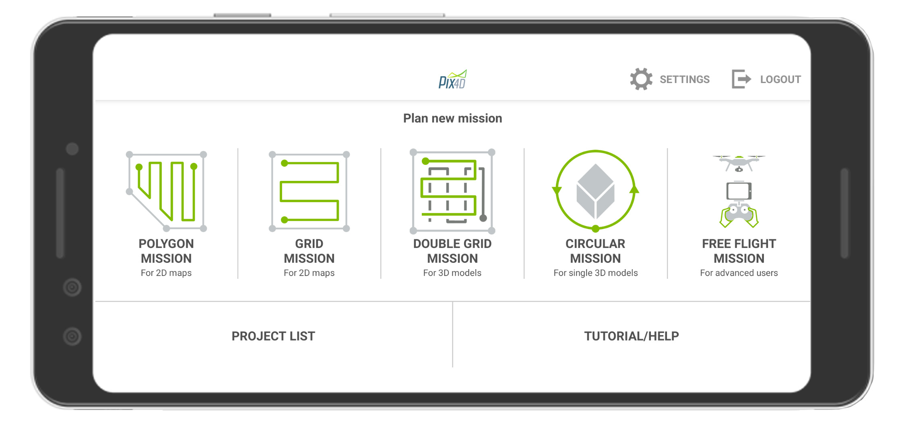

> - Once you open the app Pix4DCapture on your Android or Apple device, choose *Double Grid Mission* for best results.

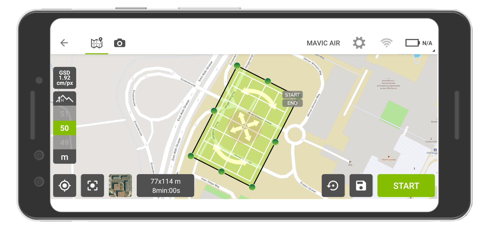
> - You can now select the area you want to survey, and press start to lauch the mission.

Please take note of the following points:
* GSD Ground Sampling Distance is the expected resolution of the topographic data. By increasing or decreasing the flight-height of the quadcopter, you can decrease or increase the resolution respectively.
* The app show the total area to be surveyed, and an estimation on the flight-time. Make sure you have enough battery to be able to complete the mission.
* Take note of the start and end-point on the map so you know what the quadcopter is doing during the mission at all times. Once you are in the mission, you can abort the flight at any time.

---

## Part 2: Image Processing

The processing of the images will be done using Agisoft Photoscan Professional (now called Agisoft Metashape). This is a stand-alone software product that performs photogrammetric processing of digital images and generates 3D spatial data to be used in your landscape architectural projects. Alternative software is available like [Pix4D Mapper](https://www.pix4d.com/product/pix4dmapper-photogrammetry-software), [Autodesk ReCap Photo](https://www.autodesk.com/products/recap/overview?plc=RECAP&term=1-YEAR&support=ADVANCED&quantity=1#internal-link-photo-processing), [DroneDeploy](https://www.dronedeploy.com/), etc.

### Creating a new project

Once you have your images on your local drive, open Agisoft Photoscan Professional and create a new project.

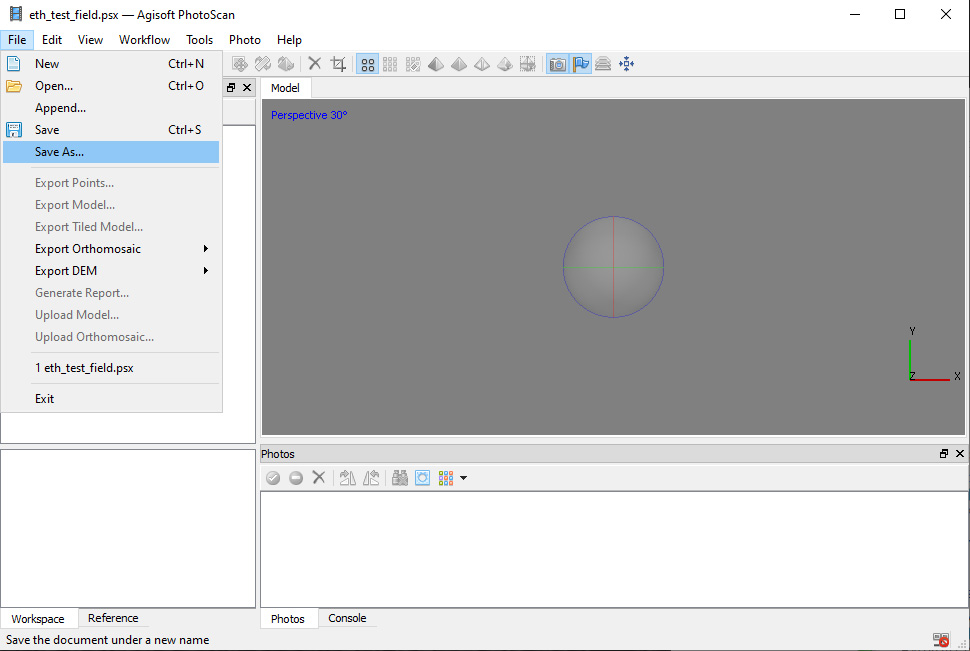

> - Save your project on a local drive

---

### Add the images

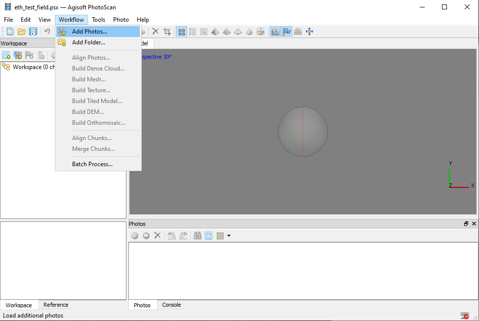

> - Go to the menu item **> Workflow** and click **> Add Photos**

---

### Align the images

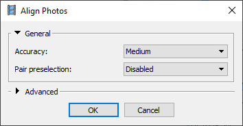

> - Go to the menu item **> Workflow** and click **> Align Photos**
> - Use a low accuracy to start, this process can take a long time...
> - Pair Selection: 'disabled'

At this stage PhotoScan finds matching points between overlapping images, estimates camera position for each photo and builds sparse point cloud model. You should now have a preview of the 3D model in low resolution, with the position and direction of the photos:

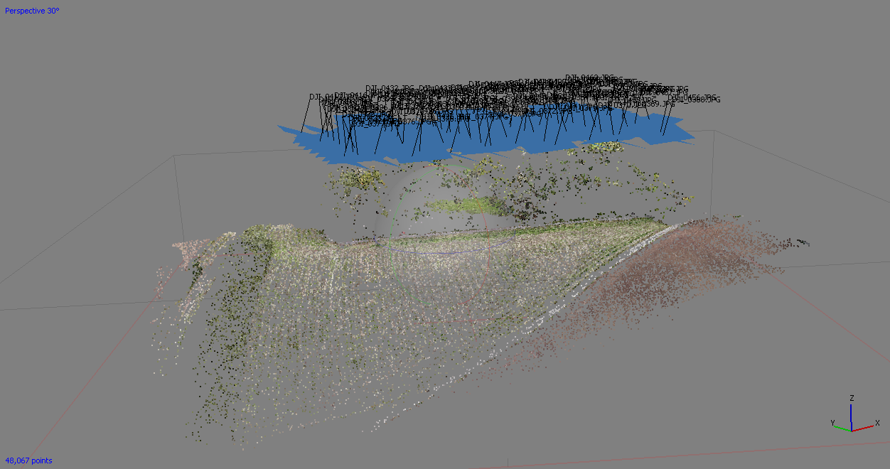

---

### Build a dense cloud

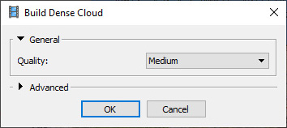

> - Go to the menu item **> Workflow** and click **> Build Dense Cloud**
> - Use a low quality to start, this process can take a long time...

Based on the estimated camera positions the program calculates depth information for each camera to be combined into a single dense point cloud. You should now have the full resulution of the point cloud:

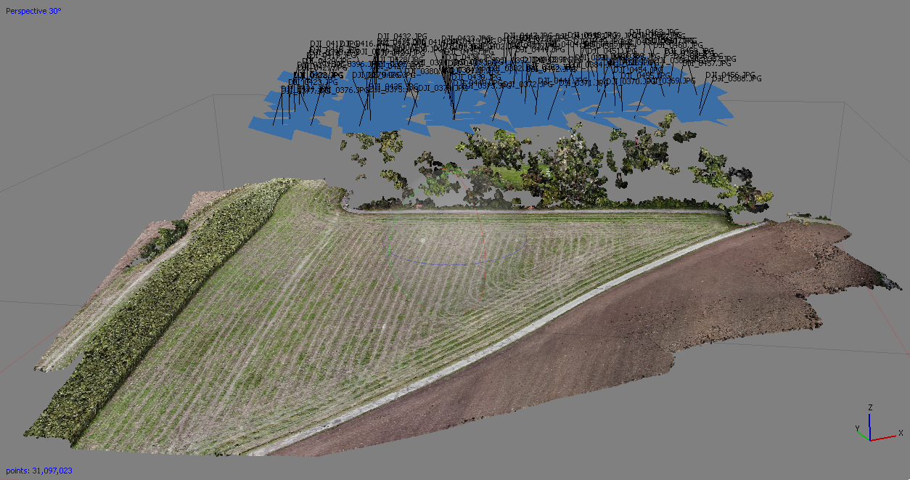

---

### Classify ground points

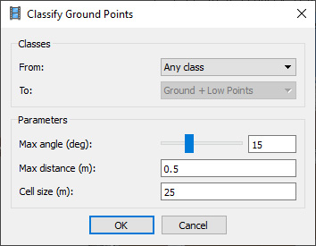

> - Go to the menu item **> Tools > Dense Cloud > Classify Ground Points**
> - From: Any Class
> - In order to get the best results, you might have to change the angle, distance, and cell size parameters. The following parameters worked well for me:
> - Max angle (deg): 15
> - Max distance (m): 0.5
> - Cell size (m): 25

To create a Digital Terrain Model in the next step, this step differentiates ground-points from other elements (like trees, buildings, etc). You can view the classified points by clicking on the menu bar icon "Dense Cloud Classes": 

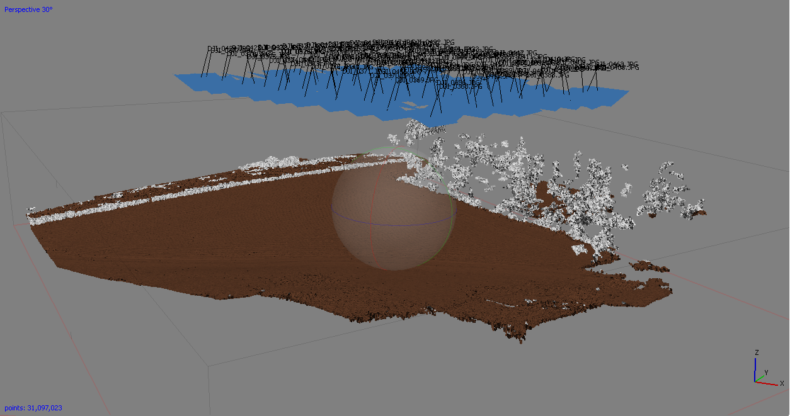

---

### Build a Digital Terrain Model

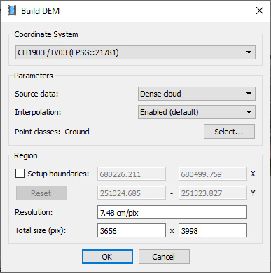

> - Go to the menu item **> Workflow** and click **> Build DEM**
> - Coordinate System: CH1903/LV03
> - Source Data: Dense Cloud
> - Interpolation: Enabled
> - Point classes: Ground

You can view the Digital Elevation Model by double-clicking on the DEM-layer in the Workspace Pane:

Digital Surface Model including trees, buildings etc.:

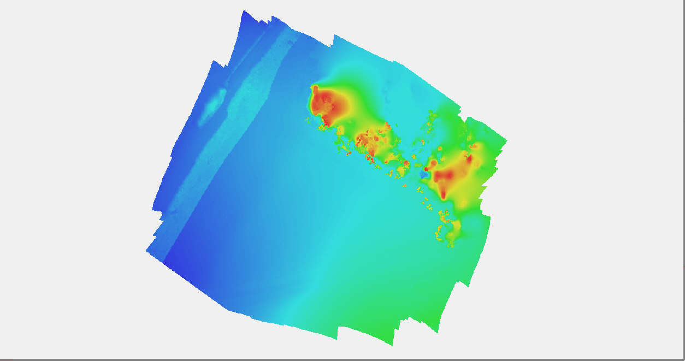

Only Ground Points:

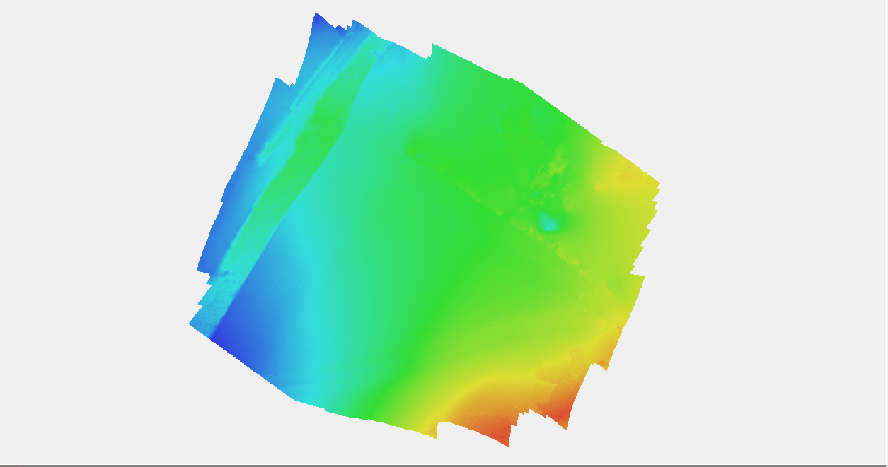
---

### Build an Orthophoto

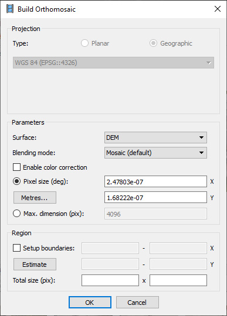

> - Go to the menu item **> Workflow** and click **> Build Orthomosaic**
> - Coordinate System: CH1903/LV03
> - Source Data: Dense Cloud
> - Interpolation: Enabled
> - Point classes: Ground

Note: If you are not happy with the result, try building a mesh surface first, and then re-build the orthophoto from the mesh instead of the DEM. You can view the Orthophoto by double-clicking on the Orthomasaic-layer in the Workspace Pane:

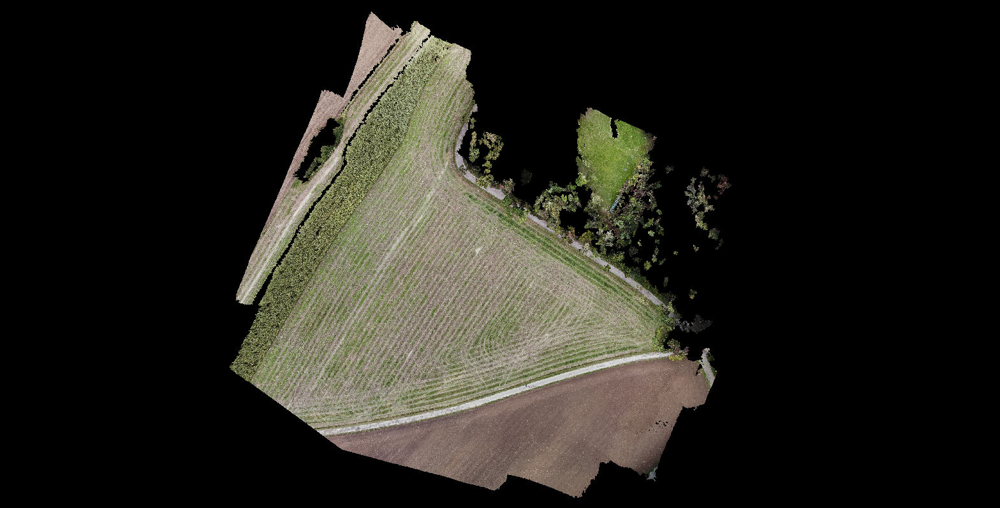

---

## Part 3: Exporting Data

Please note: Because we have not registered the images with ground control points, the data will not be in its exact geographical location, e.g. likely a few meters off in *x* and *y* axis. It will also not have the correct *z*-heigth. After you export your data you can view it in CloudCompare/GIS. 

### Export a full point cloud

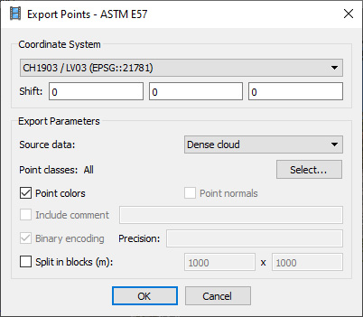

> - Go to the menu item **> File** and click **> Export Points**
> - Select *ASTM E57 (*.e57)* as export format. 
> - Coordinate System: CH1903/LV03
> - Source Data: Dense Cloud
> - Point Classes: All
> - Point Colors: [x]
> - Split in blocks: []

---

### Export ground points only

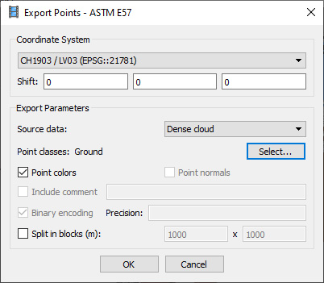

> - Go to the menu item **> File** and click **> Export Points**
> - Select *ASTM E57 (*.e57)* as export format. 
> - Coordinate System: CH1903/LV03
> - Source Data: Dense Cloud
> - Point Classes: Ground
> - Point Colors: [x]
> - Split in blocks: []

---

### Export the Digital Terrain Model

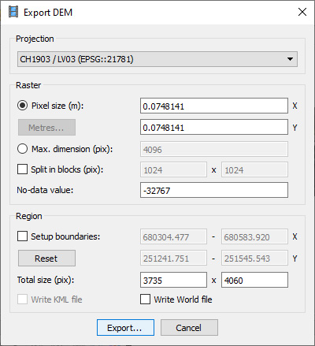

> - Go to the menu item **> File > Export DEM >** and click **Export TIFF/BIL/XYZ** 
> - Projection: CH1903/LV03
> - Click **Export**
> - Save as XYZ (*.xyz)

---

### Export the Orthophoto

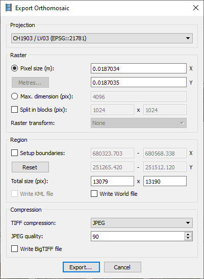

> - Go to the menu item **> File > Export Orthomosiac >** and click **Export JPEG/TIFF/PNG** 
> - Projection: CH1903/LV03
> - Click **Export**
> - Save as JPEG/PNG, whatever you prefer(the TIFF format maintains the geographic location when you open it in a GIS program).

---

*end*

