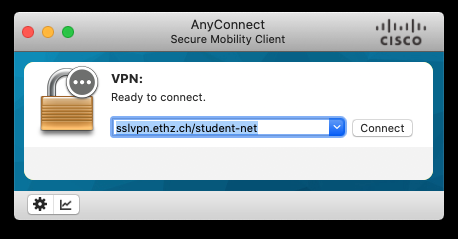
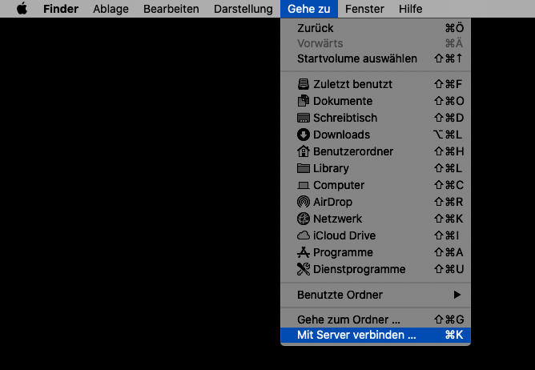
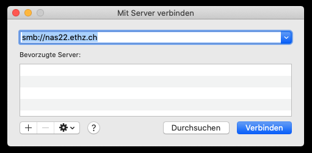
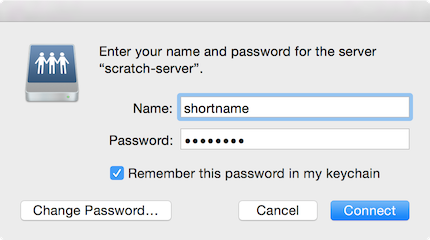
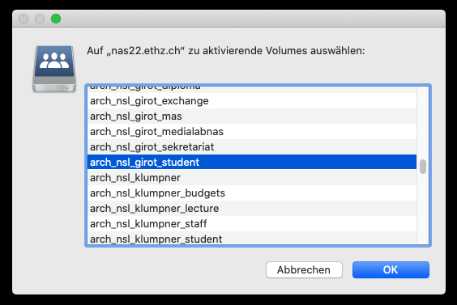
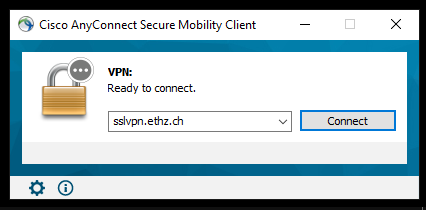
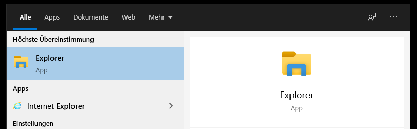
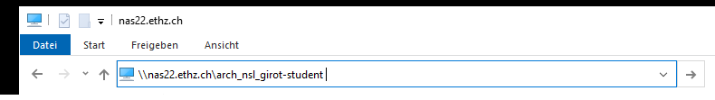
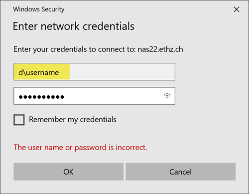

# server access

- [mac user](#macOS-X-users)
- [windows user](#windows-users)

The address to the LUS MSCLA Student Server is:  **\\\nas22.ethz.ch\arch_lus_mscla_student**  
The address to the Girot Student Server is:  **\\\nas22.ethz.ch\arch_nsl_girot_student**

The ISG D-Arch host a variety of servers:

- personal share staff members and students D-ARCH    (home.arch.ethz.ch)
- group share staff members and students D-ARCH    (nas22.ethz.ch)
- archive shares D-ARCH    (archiv-server.ethz.ch)
- software download shares IT-Shop (https://itshop.ethz.ch/)

---

## macOS X users

First make sure you have an VPN connection if you are outside the ETH Network.

VPN Connection: https://it.arch.ethz.ch/vpn-mac/

If you already have a VPN connection or you are inside the ETH-network you can open your finder.

### 1.

> **go/connect to server** (shortcut: cmd+K)

### 2.

>enter the following server address: smb://nas22.ethz.ch

### 3.

>type in your ETH username and your password

### 4.

>choose the girot_student server. Note, in this window all shares are listed, even if you have no access to them.

---

## windows users

First make sure you have an VPN connection if you are outside the ETH Network.

VPN Connection: https://it.arch.ethz.ch/vpn-windows/

#### 1.

If you already have a VPN connection or you are inside the ETH-network you can open your finder.

### 2.

> open a new file explorer window.

### 3.

> type in the following adress into the top bar: **\\\nas22.ethz.ch\arch_nsl_girot_student** or **\\\nas22.ethz.ch\arch_lus_mscla_student**  
or if it does not work: **\\\nas22.ethz.ch\ (to see all server addresses and navigate to your desired address)

### 4.

> Log in with your ETH-Username (with a d in front of the Username) and Password. It also works with username@ethz.ch
