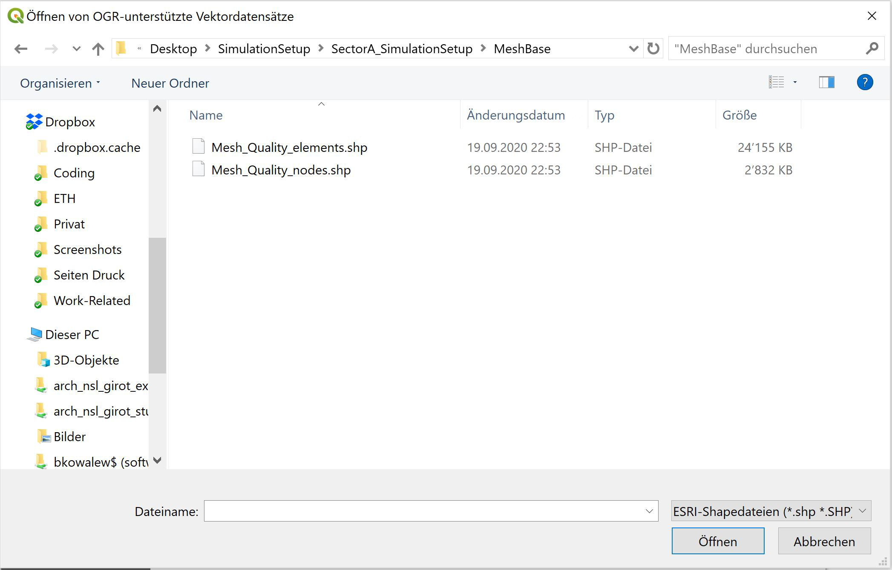

# Simulation Workshop
```
PROF. CHRISTOPHE GIROT
CHAIR OF LANDSCAPE ARCHITECTURE

Administration:
Claudia Janz
HIL H 57.2
ETH Hönggerberg
CH-8093 Zürich
T +41 (44) 633 29 87
www.girot.arch.ethz.ch

Teaching team:
Benedikt Kowalewski

kowalewski@arch.ethz.ch

LANDSCAPE VISUALIZATION AND MODELING LAB
LVML

HIL H 40.8
ETH Hönggerberg
CH-8093 Zürich
http://www.lvml.ethz.ch
```


---

## Content
*Just jump to the topic you are looking for*


- [.ASC File Export](#.asc-file-export)
- [BaseMESH Installation](#basemesh-installation)
- [Import of Layers](#import-of-layers)
- [Interpolation](#interpolation)
- [Mesh Export](#mesh-export)
- [Basement](#basement)
- [ Visualization of the Results in ParaView](#visualization-of-the-results-in-paraView)

---

## GETTING STARTED: PREPARING THE INPUTS

---

## .ASC File Export

>To setup the simulation you will need to export an .asc file of your topography. Use the following setup in Grasshopper and Docofossor to export the file. After pressing the button the file will save in the same location as the grasshopper file.


---

## BaseMESH Installation

>While BASEMENT, a numerical modeling tool for water simulations is a separate program, it heavily relies on its little brother BaseMESH, a plugin for QGIS. So before we can run any simulation in BASEMENT, we have to prepare the data in BaseMESH.
>
>First of all we need to download and install BaseMESH. For this please start QGIS. After the startup you will see the general interface. As we only use QGIS for data conversion this tutorial will not cover how to operate QGIS.


>To install the new plugin BaseMESH, please click on the dropdown menu "Erweiterungen" and then "Erweiterungen verwalten und installieren...".

>Within the pop-up choose "Einstellungen" on the left and click "hinzufügen" to load a new plugin repository.


>To add a new repository, give it a name in the first line (e.g. BaseMESH) and link it to an online repository: Please use the link at the bottom of the page: (If the pasted link does not work, copy it to your browser and press enter. I should connect to a page called "Quantum GIS Python Plugins". If this page opens correctly, copy its URL and past it in the URL field in QGIS) Press OK.


>http://people.ee.ethz.ch/~basement/qgis_plugins/qgis_plugins.xml

>Now go to the tab "Alle" in the QGIS plugin settings and search for BASEmesh. Once found, select the plugin and install it by clicking "Erweiterung installieren".


>Afterwards you should be able to see the new BASEmesh toolbar in your QGIS Interface. Now it is time to add the simulation mesh and inform it with your topography.


---

## Import of Layers

>First start a new empty project by clicking into the respective field in the interface. To Import a new layer go to "Layer" > "Layer hinzufügen" and then select "Vektorlayer hinzufügen". Alternatively press STR+Umschalt+V.


>In the field "Quelle" navigate to the simulation folder and switch the file
type to .shp (ESRI Shapefile). Select Mesh-Quality-Elements.shp and click "open". Click "Hinzufügen" to add the layer to QGIS. Repeat the process for Mesh- Quality-Nodes.shp. Thirdly, to import the .asc topography select "Rasterlayer hinzufügen" and navigate to your exported .asc file. Click "Öffnen" and "Hinzufügen" to add the Rasterlayer to QGIS. Close the layer import options.





>Your layer tab should now look something like that:


---

## Interpolation

>To inform the mesh nodes about the topography of the site we have to inform them with the raster elevation map. Select the BASEmesh tool "Interpolation" and fill in the fields as shown on the right. In the field "Elevation data" switch from "elevation mesh" to "digital elevation map" and select your .asc file. Save the Output as "Interpolated-Mesh-Nodes" Click "interpolate elevations"


>You will now have a new layer called "Interpolated-Mesh-Nodes". The old file "Mesh-Quality-Nodes" can be turned off.

---

## Mesh export

>To export the generated layers for simulation select the BASEmesh tool "Export Mesh" and fill in the fields as shown on the right. Save the Output in the simulation folder as "Simulation-Mesh".
>
>Click "Export Mesh"
>
>This might take up to 20 minutes.


>We are now done with the preparation in QGIS and BASEmesh and can switch to BASEMENT. You can save and close the QGIS file.

>TIP: Some BASEmesh windows are not displayed properly. This is unfortunately unresolved until now. Try to rescale the window by dragging the window edges.


---

## Basement

>To start simulating in BASEMENT you will need four files:
1. The mesh you exported from BASEmesh
2. The hydrograph-ChliSchliere.txt
3. The hydrograph-Meisibach.txt
4. The run-BM.bmc

>To keep the inputs somewhat related to the simulation I recommend to save all files in the same folder. (Folder name e.g. 200922-Simulation-SectorA)

>Now search for BASEMENT v.2.8 and start the program. In "File" click "Open Command and navigate to the run-BM.bmc file and open it. If it did not open automaticaly click "Edit Command" in the general BASEMENT interface.


>Now we need to connect BASEMENT the mesh we just generated. To do so expand all folders in the command window and navigate to the "Geometry" Tab. Within the geometry tab go to "load file" and select the mesh you generated with BASEmesh before.


>To define our inflows navigate to "Boudary (hydrograph)" and link the hydrograph-Meisibach.txt in the field that says "inflow" in the string name field at the bottom Link the hydrograph-ChliSchliere.txt in the other boundary field (here the string name should be inflow-II).


>Lastly make sure that your export format is .vtk so it will be compatible with the visualization tool.


>Now we are ready so simulate. Save the run file under "File" > "Save", the close the editing window.
>
>In the general BASEMENT window you will now be able to start the simulation by clicking "Run".
>
>This simulation in its current setup roughly takes 3:15 hours to finish.

---

## Visualization of the Results in ParaView

>To visualize the simulation results we need yet another program called "ParaView". This free scientific visualization program can be downloaded for MacOS and Windows from the following website: https://www.paraview.org/

>Once opened we need to import our simulation data to the program. Go to "Open" and navigate to the Simulation folder. All .vtk files should be displayed as one file. Open them and click "Apply" in the general ParaView interface.


>You should now be able to see the simulated area and its topography. If not please click on the little eye icon next to the layer in the "pipeline browser"


>To get our simulation setup for the export we can view and adapt certain parts of the data
1. Tools to control the view (Top, front etc.)
2. Scroll through the simulation frames or play the animation.
3. Changing the displayed colour to depth instead of the base model. Click edit to open the dialogue on the right. Toggle the colour editing by clicking twice on the lock symbol next to the edit button.
4. Adapt the colour range to make the water more visible. Click on the central point and type "0.1" in the data field as shown in the extract.


>Now we are ready for exporting the simulation. To do so, go to File > Save Animation and choose .avi to get your simulation as a video file.
