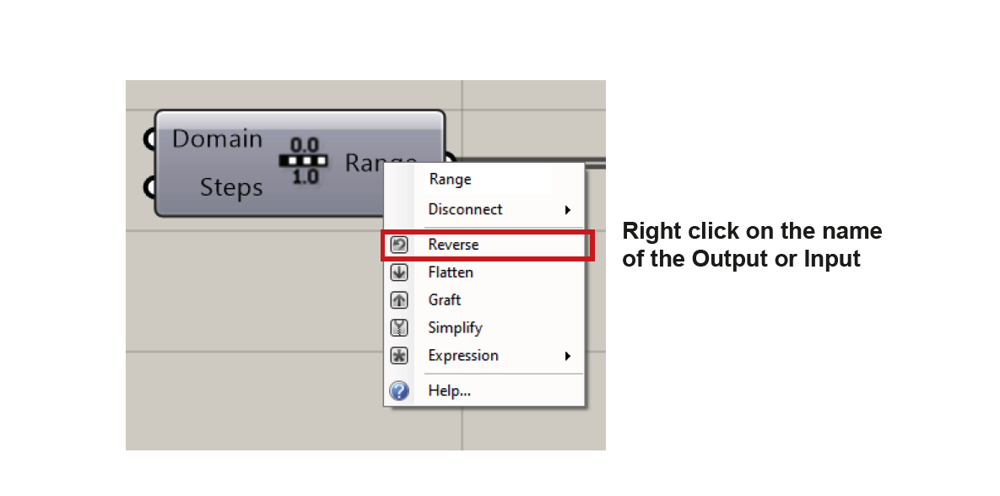

# Grasshopper Tutorial
---

## Content

*Jump to the topic you are looking for*

- [Introduction](#introduction)
- [Launch Grasshopper](#launch-grasshopper)
- [Interface and Workplace](#interface-and-workplace)
- [How to use the Components](#how-to-use-components)
- [Connection between Rhino and Grasshopper](#connection-between-rhino-and-grasshopper)
- [Data in Grasshopper](#data-in-grasshopper)
- [Manipulating the In-/Output Data](#manipulating-the-data-in--and-output)
- [How to install a Plugin](#how-to-install-a-plugin)
- [Shortcuts](#shortcuts)
- [Links to further Tutorials](#links-to-further-tutorials)

---

## Introduction

Welcome to Grasshopper. For designers who are exploring new shapes using generative algorithms, Grasshopper® is a graphical algorithm editor that takes advantage of Rhino‘s existing tools. Grasshopper offers new ways to expand and control the 3D design and modeling processes, including automating repetitive processes, generating geometry through mathematical functions, quickly making changes to complex models, and creating complex forms through repetitions of simple geometry. Grasshopper requires no prior programming or scripting knowledge, and allows designers a high degree of flexibility in creating both simple and complex forms.

The combination of Rhinoceros with the Grasshopper plugin makes parametrizing structures via a clear, visual programming interface possible. Parametric objects in Grasshopper are generated through graphic programming. These objects can be modified and adapted within Grasshopper simultaneously affecting the corresponding object in the Rhino modelling interface.

This tutorial should give you an overview about Grasshopper itself as well as the navigation and basic components. Further it shows how the plugin connects with Rhino and some important shortcuts for a smoother usage.

---

## Launch Grasshopper

Since Rhinoceros3D version 6, Grasshopper is directly included in Rhino as a plugin.
By typing „Grasshopper“ into the Rhino command prompt the plug-in will load automatically and this main Grasshopper window will show up:

---

## Interface and workplace

>1. The main menu bar:
The menu is similar to typical Windows menus. Each menu shows more commands to edit the set	tings or the canvas itself as well as the shortcuts to these commands.
>2. File browser control:
By clicking on the file name it opens the dropdown menu which can be used to switch between different loaded files.
>3. Component panels:
This area exposes all component categories. All components belong to a certain category (such as „Params“ for all primitive data types or „Curves“ for all curve related tools) and all categories are available as unique toolbar panels. The height and width of the toolbars can be adjusted, allowing for more or fewer on-screen buttons per category. The toolbar panels themselves contain all the components that belong to that category. Since there are a potentially large number of these, it only shows the most recently used items. In order to see the entire collection, you have to click on the bar at the bottom of the Panel:

>4. The canvas:
The canvas is the main workplace where all the components will be arranged. The canvas toolbar provides quick access to a number of frequently used features. All the tools are available through the menu as well, and you can hide the toolbar if you like. (It can be re-enabled from the View menu).

>A) Opens a Grasshopper file (.gh or .ghx)  
>B) Save the current file  
>C)	Zoom defaults  
>D) Zoom Extents (will adjust the zoom-factor if the definition is too large to fit on the screen)  
>E)	Create a named view (choose between all named views by klicking on the tiny arrow next to it)  
>F) Sketch tool:  
 	The sketch tool works like most pencil-type tools of Photoshop or Windows Paint. Default controls of the sketch tools allow changes of line weight, line type, and color. However, it can be quite difficult to draw straight lines or pre-defined shapes. In order to solve this problem, draw out any sketch line onto the canvas. Right click on the line, and select „Load from Rhino“, and select any pre-defined shape in your Rhino scene (This can be any 2d shape like a rectangle, circle, star...etc.). Once you have selected your referenced shape, hit Enter, and your previously drawn sketch line will be reconfigured to your Rhino reference shape.  
G) Hide preview geometry  
H) Show wireframe preview geometry  
J) Show shaded preview geometry  
K) Draw a preview boundary on the canvas to exclude objects. Press ESCAPE to remove any existing boundary.  
L) Only draw preview geometry for selected objects  
M) Document preview settings  
N) Preview mesh quality  

>Objects on the canvas are usually color-coded to provide feedback about their status:

>A) All objects selected within the Grasshopper canvas are drawn with a green overlay.  
>B) Parameter which encountered neither warnings nor errors.  
>C) Parameters which encountered a warning are displayed with an orange box. (A lof of parameters and components are orange when you drop them onto the canvas since the lack of input data is considered to be an error.)  
>D) Component which encountered neither warnings nor errors.  
>E) In comparison to a parameter a component is a more complex object, since it contains input and output parameters and one or more data transformations. This particular component has at least 1 warning associated with it. You can find warning and errors through the context menu of objects.  
>F) Component which encountered at least 1 error. The error can come either from the component itself or from one of its input/output parameters. We will learn more about component structures in the following chapters.  

---

## How to use Components

Every Component can be added with drag and drop to the canvas or by double clicking onto the canvas and typing its name.Alternatively you can also click space and start typing the name of your desired component. A lof of components are very similar to common commands and functions within Rhino. If you have a certain action in mind and know its command for Rhino, try finding the corresponding component in Grasshopper.

#### Component basics

>If you hover over the input node of a component for a few moments a window will pop up, giving you more information about the type of input this component expects. By connecting a parameter or the output of another component you can feed data to the input node.
To directly set the data source without connecting an input parameter or component right click on the input not and  select "set one [data source]" (or multiple inputs).

#### Zoom-In interface

>Some components offer additional input nodes if you zoom in. With the plus (+) and minus (-) you can add or remove input nodes from the component if needed.

---

## Connection between Rhino and Grasshopper

Inputs and outputs from Grasshopper can be connected with the workspace inside of Rhino. An object from Rhino can be a Grasshopper input but it can also be generated with Grasshopper and then be used in Rhino. The command to make objects from Grasshopper editable in Rhino is called "bake". Right click on a component or parameter to get access to the bake command.

>Here you see the Rhino viewport and Grasshopper canvas side by side. The three spheres in the rhino workspace illustrate  their origin through a destinct color coding:  
> 1. The grey one on the left is generated in Rhino with the command "sphere". It is also editable and can interact with other rhino objects.  
> 2. The red one in the middle is generated with the sphere component from Grasshopper. The red wireframe indicates an origin from Grasshopper. Red also means, that the component containing this geometry an Grasshopper is currently not selected.  
> 3. If you activate the component in Grasshopper it not just turns green in Grasshopper. The red wireframe in the Rhino viewort turns green as well.  

#### Transfer output from Grasshopper to Rhino

>Red and green Grasshopper wireframe "holograms" in the Rhino viewport are not editable with Rhino and cannot interact with Rhino objects (no snapping etc.). To enable editing you can „bake“ geometry. Simply right click on the output you would like to transfer to rhino and choose "bake".

>A window will show up. Here you can define on which layer you would like to place the geometry on after baking. Click "ok" to bake it.

>Now we have baked the right sphere. Visually and in regard to its behaviour it is now the same as the one we created within Rhino with the "sphere" command (the one on the left).   
>ATTENTION: After baking the object, it is no longer connected to grasshopper and is not affected by any changes made in Grasshopper.

---

## Data in Grasshopper

#### Distributing data

>Data can be distributed to components in three different ways: internally, referenced (right click on the component), or externally as an output of another component.

#### Data Management

>Data in Grasshopper is managed in three different ways: 
>1. As a single data item  
>2. As a list of items  
>3. As a "data tree" (a list containing lists)

#### List

>Lists store your data and organize several data items. Each data item has a specific position inside of the list called the "index number" (the first object has the index number "0"). An item can consist of any data known to Grasshopper (a file, a line, a point, color information etc.). Data items can also be empty (Null object). With the following components you can manipulate and change your lists.
For example: split list, shift list, list leght, list item...

Under the following link you can find an overview of list operations in Grasshopper:
http://wiki.bk.tudelft.nl/toi-pedia/Grasshopper_Basic_List_Actions

#### Data-Tree

>Some components create an output of multiple lists. They are stored in so called data trees. They basicly work like a folder structure on your computer. They are lists of lists and can vary greatly an complexity.

>You can view the data tree with the "param viewer" component. The image above shows a single branch (0:0). This main branch has nine sub-branches which start with the number of the parent branch. So the first one is (0:0:0) second one (0:0:1) and so on. It allows you to understand the data's location within the tree.

---

## Manipulating the Data In- and Output

By right-clicking on the in- or output of a component you can choose different options to manipulate the data stream. The options are Reverse, Flatten, Graft, Simplify and Expression.

#### Reverse

>Reverse
By activating the Reverse function either on the input or the output it will reverse the order of the items. (for example the item from index 0 is now on index 10 and the one from 10)

#### Graft / Flatten

To understand this function we have to understand how grasshopper manages and organises data. Multiple lists are stored in trees and each tree has a branches. 
Graft and Flatten manipulate the branches. Graft will create a new level of possible branches, while Flatten does the opposite and collapses one level of complexity of a data tree.  
In this example we create a series of points (ten points with a distance of 10 from each other along the z axes).
We will now have a look at this command on an example:

>we create a series which counts 10 steps and each step shifts by 10 along the z axis.

>This component generates one branch (or sub-list). The name of the output list and its "complexity" (amount of branches or sub-lists) is listed on the top (0,0). Further down we see that we have 10 points with an index from 0 to 9. As well as the coordinate of each point.

>Now we can right-click on the output node of the „construct point“ component and click on graft.

>Graft now puts every point into a seperate branch (or sub-list). The first branch with the index 0 (0;0;0), the next one is (0;0;1) and so on.
This effects the datastructure for further manipulation. If we now try to move the points along the x-axis they will react differently.

>With this definition we move 5 points along the x-axis by a distance of 10 units.

>If all points are in the same branch, Grasshopper moves the first five points of the branch by 10 units, while the rest of the items remain at the position of the  5th item.

>If we flatten the data before applying the transformation, the additional sublists are being collapsed and the data items are stored in one list again.

>an overview with all steps from graft to flatten a list.

#### Simplify

>Simplify allows you to collapse all empty branches leaving the data tree with the minimum of necessary complexity. While graft created groups with a data path (0,0,1), simplify reduces all empty branches. The new groups are now just (0), (1) etc.
Also visible in the Parametric Viewer. Instead of creating branches, the component "Simplify-Tree" creates trunks of data trees.  
(see picture bellow)

#### Expression

>The expression option allows you to manipulate the data with a mathimatical expression (in this example x*2, so the data will be scaled by a factor of two).
You can also use the „expression“ component for the same result. It is a little bit more user-friendly.

---

## How to install a Plugin

A plugin is a software component that adds specific features to an existing computer program.
Grasshopper as well as Rhino allows the installation of plugins. These additional components allow functional extensions or the simplification of certain operations.

#### Installation

Installing a plugin for Grasshopper only needs a few steps.
Shown here is an example with the "Docofossor" plugin. It is a terrain modeling plugin for Rhino and Grasshopper. It enables easy editing of cut and fill operations for landscape architecture.  

>1. Download the plug-in from [Food4Rhino](https://www.food4rhino.com/) - you will need to create an account - and unzip the downloaded folder.

>2. Launch Rhino and run the **Grasshopper** command.

>3. Open *File* > *Special Folders* > *Components Folder*

>4. Copy the the .ghpy file from the unziped folder in the window that opened. Close the window when done .

>5. The Docofossor panel will appear as a component panel together with the all its additional components. If not, restart Grasshopper and/or Rhino.

---

## Shortcuts

| Shortcut      | Description |
| ----------- | ----------- |
| Hold left and select | Select things in the canvas |
| Hold right and move | Move the canvas |
| Ctrl + Z | Undo |
| Ctrl + Z | Redo |
| Ctrl + X | Cut out |
| Ctrl + C | Copy the component |
| Ctrl + V | Paste next to the copied component |
| Ctrl + Shift + V | Paste in the middle of the window |
| Space or double left-click | Opens command prompt to type in the name of the component |
| Shift  + dragging from one to another component | Connects to the component even if there is already one existing connection (this allows multiple connections for components which usually allow only one input) |
| Ctrl + dragging from one to another component | Disconnects the only one connection |
| Alt + hold left | Extends your canvas horizontally (keeps existing components as they were) |
| Alt + hold left + Alt | Extends your canvas vertically (keeps existing components as they were) |
| Hold left on component + Alt and drag	 | Copy the component and move it to wherever you want |
| Ctrl + Alt + Hold left on component  | Shows the location of the component in the toolbar |
| Mark component + hold Ctrl + left arrow | Jump automatically to the beginning of the wire and the previous component |
| Mark component + hold Ctrl + right arrow | Jumps automatically to the end of the wire |
| Mark component + hold Ctrl + Shift + left arrow | Selects all components connected to the marked one |
| Ctrl + Shift + Q | Generates a screenshot which can be edited |
| Ctrl + Q | Hides all selected components from the Rhino view |
| Ctrl + Shift + I | Selects all components except the selected ones |
| Ctrl + Shift + drag by holding left | Drag all connected wires to another component |

---

## Links to further Tutorials

https://static1.squarespace.com/static/51c6f9f3e4b0e47ad1bbc71c/t/521cf940e4b021571fc7d3a5/1377630528615/Grasshopper+Primer_Second+Edition_090323.pdf

http://s3.amazonaws.com/mcneel/grasshopper/1.0/docs/en/AlgorithmicModelling.pdf

https://grasshopperdocs.com/
