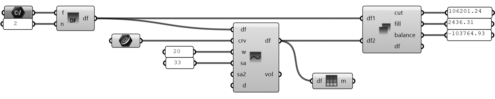

# Grasshopper 

For designers who are exploring new shapes using generative algorithms, Grasshopper® is a graphical algorithm editor tightly integrated with Rhino’s 3-D modeling tools. Unlike RhinoScript, Grasshopper requires no knowledge of programming or scripting, but still allows designers to build form generators from the simple to the awe-inspiring. Grasshopper is included in Rhino 6.

#### Getting Started

In general, you will find a lot of information online just by doing a google search. However, a good place to start to acquire more information about Grasshopper can be found here: 
- Getting Started with Grasshopper 3D: [Learning Materials](https://www.grasshopper3d.com/page/tutorials-1)
- Introduction to Grasshopper: [Videos](https://vimeopro.com/rhino/grasshopper-getting-started-by-david-rutten)
- Foundations: [Manual](https://www.modelab.is/grasshopper-primer/)

#### Plugins (advanced)

- Docofossor: [Download the app here](https://www.food4rhino.com/app/docofossor)
- Bison: [Download the app here](https://www.food4rhino.com/app/bison)

(You have to create a free account at Food4Rhino to download these plugins)

