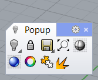
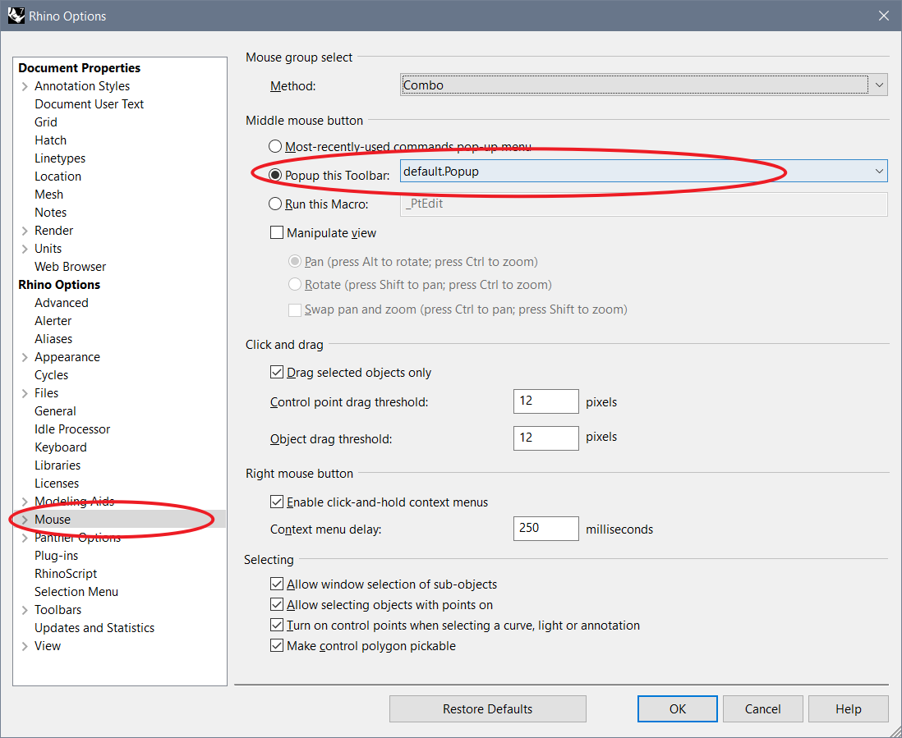
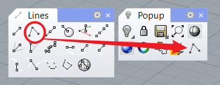
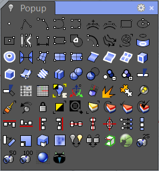

# Tips & Tricks for Rhino and Grasshopper 

## Content

- [AutoCAD Alias](##autocad-alias-import)
- [Popup Toolbar](## Popup Toolbar)

## AutoCAD Alias Import

If you're an expert of AutoCAD, there's a way to import AutoCAD Aliases into Rhino. You can then use the keyboard shortcuts to speed up your modeling process.

Steps:

1. Download the alias file here: [autocad-alias](./doc/AutoCAD_alias_for_Rhino.txt)

2. Select from Menu: Tools->Options->Aliases:

   

3. Click "Import" and load the downloaded file.

4. Confirm with any warning of "overwritten the current aliases".

## Popup Toolbar

Rhino's native approach to access the short-cut commands is to use the *pop-up toolbar*. You can activate it by clicking the default middle-button on your mouse (you need to click on the small title bar of the pop-up to make it activated as normal menu):

In case of error, you can check the settings:

By pressing *ctrl* key and left-click-drag on any icon from the other toolbars, you can added the tool to this pop-up toolbar and access it quickly with your middle button:

You can add more buttons as you become more familiar with the modelling process in Rhino and make your personalized popup toolbar. See an example below:

