# 3D Printing Tutorial

## Content

This Tutorial is divided in three main topics:

- [Theorie](#theorie)
- [3D Printing Basic Knowledge for FDM](#3D-Printing-Basic-Knowledge-for-FDM)
- [How to print](#How-to-print)
- [Troubleshooting](#Troubleshooting)

---

### Theorie

- [FDM Printing](#FDM-Printing-(Fused-Deposition-Modeling))
- [SLA Printing](#SLA-Stereolithography-Printing)
- [SLS Printing](#SLS-Selective-Laser-Sintering-Printing)
- [Available Printers at RAPLAB](#Available-Printers-at-RAPLAB)

3D Printer are machines for an Additive Manufacturing process and add material instead of
removing it like a milling machine (CNC). There are a lot of different printing technologies
developed over time. In the following, we will look at the three most popular techniques.

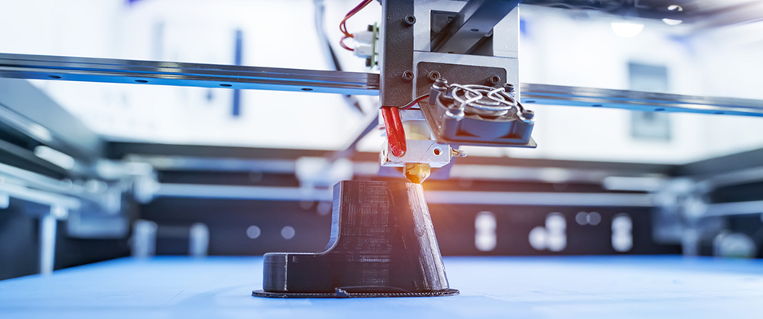

 > Picture of an FDM printer (Source: esa-automation.com)

##### FDM Printing (Fused Deposition Modeling)

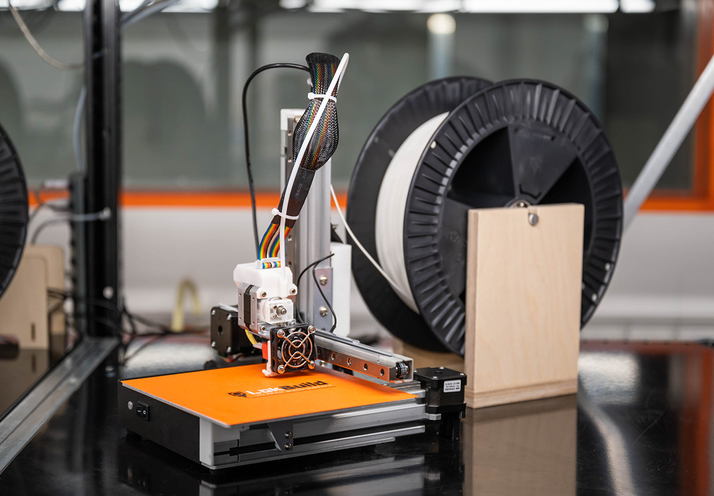

> Cetus 3D Printer, a FDM printer, at the RapLAB  (Source: raplab.arch.ethz.ch)

This is the most popular as well as the easiest and cheapest solution to an additive
manufacturing process. FDM Printing use a filament out of plastic. The most popular
filaments in the consumer market are ABS ( Acrylnitril-Butadien-Styrol) and PLA (Polylactic
Acid). The printer head heats the inserted material up distributes it in three axes. By
extruding layer by layer, it reproduces the given 3d model.
As already mentioned, it is relatively cheap and easy to print with this method. On the other
hand, this method works with a visible layer structure, and you need to print support
structure for overhangs above 45 degrees.
Both procesess will need post-process work to get a result with a smooth surface.
Possibilities include sandpaper, filler etc. The final model can also be (spray-) painted.

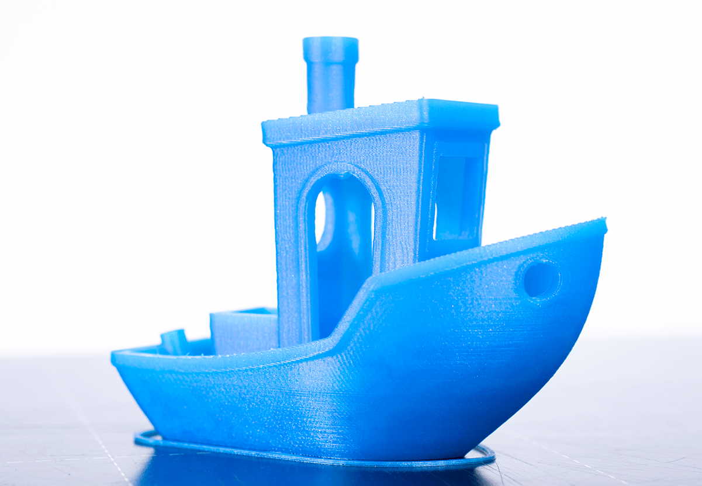

> A typical result from a FDM printer. The layerstrucutre is visible and overhangs up to 45 degrees can be printed without support structure (Source: prusa3d.com)

##### SLA (Stereolithography) Printing

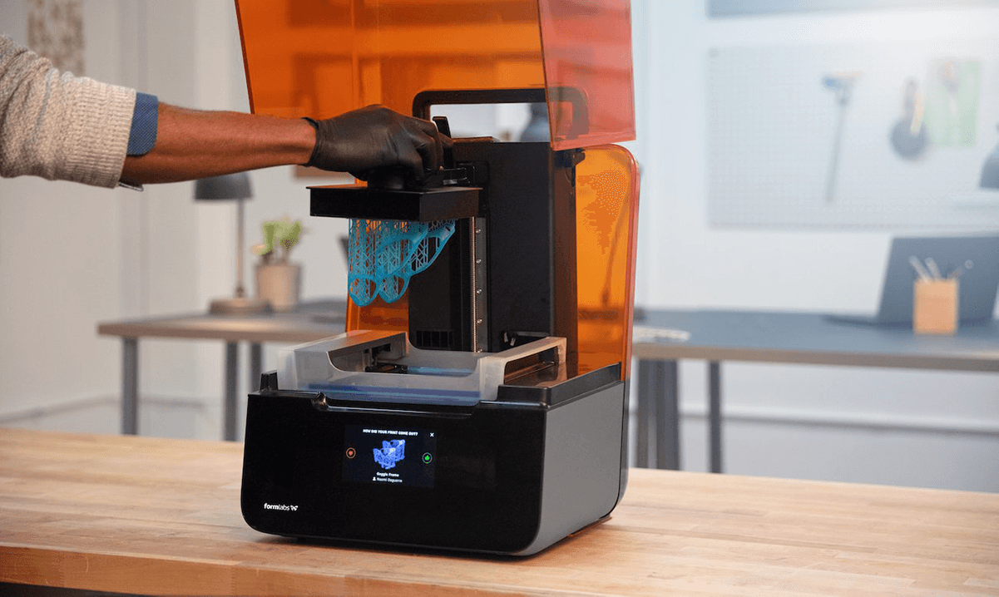

> A SLA printer. In the bottom is a container with the resin as well as the light diode that fixes the resin to the building plate. The model is printed upside down. (Source: formlabs.com)

This is the oldest 3d printing technology. Invented in the 70s uses this printer, light that fixes
a liquid resin. Other than the FDM printer this system works upside down. The print platform
lifts out of the resin basin. The light technologies enable the highest resolution for the
additive manufacturing mentioned here. Perfect smooth surfaces without visible layers are
possible.
Disadvantages to this technology: The printers are very expensive, and the resin is toxic if it
is not fixed with UV light. A well-ventilated room and safety gear is mandatory. Support
structures are also needed for SLA printing.

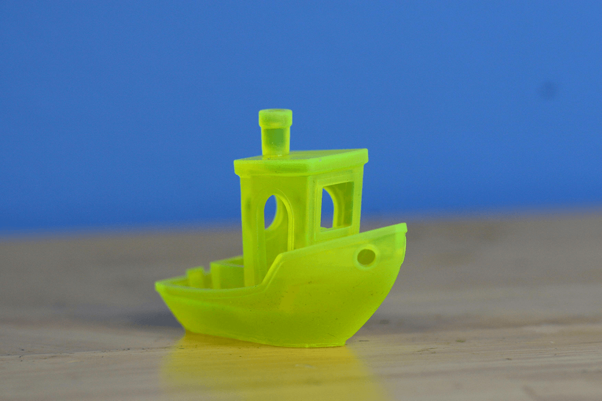

> The result of an SLA printer has a much higher resolution than a fdm printer. The corners are sharper and the layerstructure is barley visible. (Source: 3dprinterbank.com)

##### SLS (Selective Laser Sintering) Printing

> View on a print bed of a SLS printer. the white powder volume is a finished model. In a next step you blow the loose powder out to get to your printed model. (Source: sinterit.com)

The print bed is filled with a thin layer of powder. A CO2 laser melts layer by layer. The layers
are visible but covered by the not melted powder which work as a bridge and allows printing
without any support structure. As soon as the print is finished, you blow the loose powder
out of the print and your finished model appears. From all the technologies mentioned, this
one is far the most expensive.

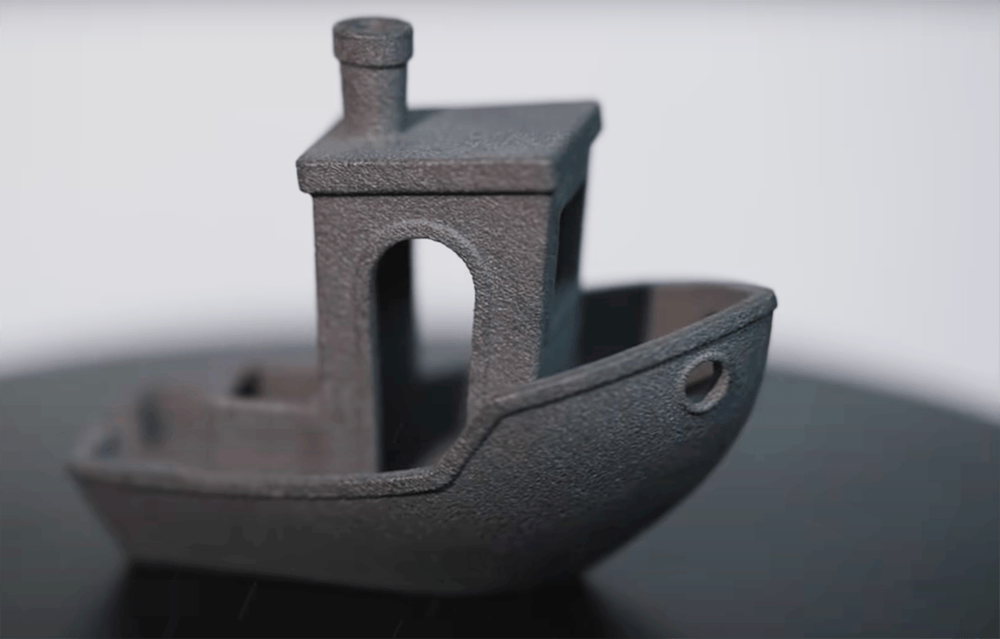

> The prints of a SLS printer have a extreme high resolution. Need no Support structure and have no visible layerstructures. (Source: youtube.com/philipps3ddruck)

##### Available Printers at RAPLAB

In the RapLab are mainly FDM printer and one SLA printer (which is only accessible for PhD
Students) available.

*Cetus 3D Printer (FDM)*

> Source (Source: raplab.arch.ethz.ch)

These printers are always loaded with white PLA filament. Which is also the only filament
allowed to print. Other colors are possible in agreement with the RapLab-Team. There are
other nozzle diameters available (Standard 0.4 mm, 0.2 mm and 0.6 mm are other options).
The print bed is unheated. Which is no problem for printing PLA but can cause warping (the
edges lift off from the print bed due to temperature difference). The max build volume is
180 mm x 180 mm x 180 mm (XYZ).

*Raise 3D Printer (FDM)*
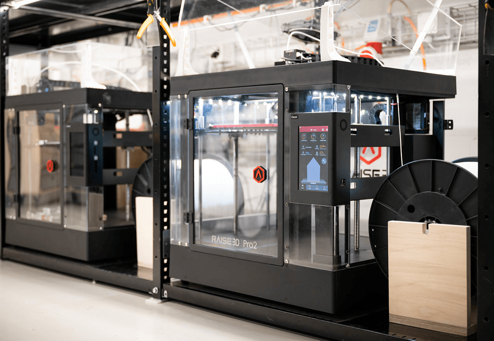

> Source (Source: raplab.arch.ethz.ch)

This printer has a bigger and enclosed build volume of 305 mm x 305 mm x 300 mm (XYZ).
This printer comes with a heated build plate. A heated build plate is supposed to tackle
warping - although not always successful at preventing it. The enclosure of the printers
helps to get a better print environment with no external impacts (like a gust of wind from a
passing human). There are two printers of this kind available at the Raplab, and the printing
preparation differs from the Cetus printer.

*Form 2 (SLA)*
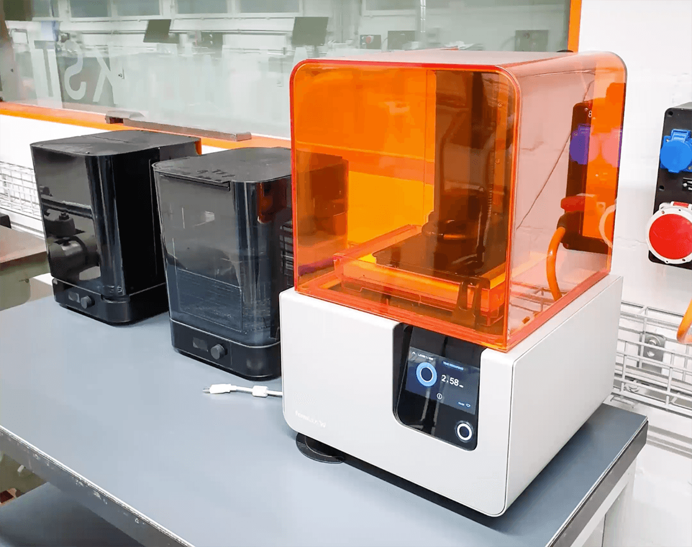

> Source (Source: raplab.arch.ethz.ch)

This is an SLA printer, loaded with white resin. Currently, this printer is only available for
PhD students. After printing, you must wash the print with isopropanol and fix it with UVlight.

---

### 3D Printing Basic Knowledge for FDM

- [Physical influence](#Physical-influence)
- [Software Influence](#Software-Influence)

##### Physical influence

There are three main physical factors which have a direct impact on the print quality besides
the given print file from you, the filament, the print speed and the nozzle diameter.
The filament defines the nozzle temperature. Which is basically the temperature that the
print head reaches to melt the filament. Only if the filament is fluid enough, it is printable. A
little too cold and it does not extrude or has no layer adhesion. Too hot, and it flows too fast
or blocks the nozzle. The average temperature for PLA is 190-220 °C. A special factor is the
printing bed. The temperature and the material of it define how (and if) the material sticks
onto the build plate. Only if the friction is high enough, the print will be a success.

*Print speed*

On a normal printer with normal cooling, PLA is recommended to print between 30-50 mm/
s. With professional hardware it is possible to reach print speeds up to 1000 mm/s. Of
course, with the compromise of stringing, layer shifts and a reduction of surface quality.

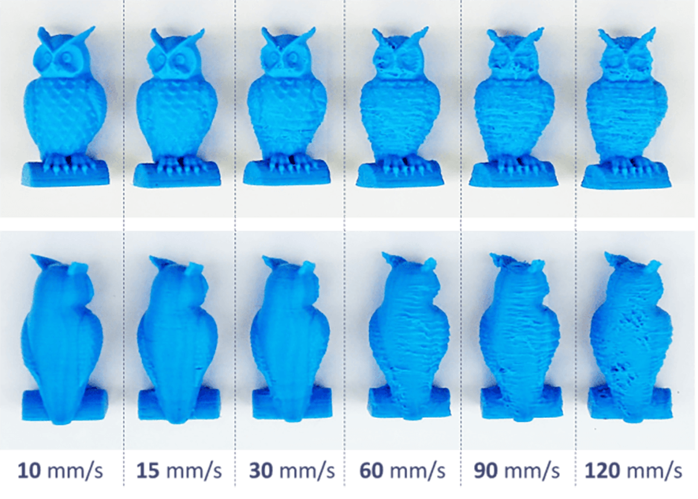

> By increasing the print speed the print quality gets worse. The filament has not enough time to cool down and connect to the previous layer. Increasing the cooling can help to solve this problem. (Source: easy3dhome.com)

*Nozzle diameter*

The standard diameter is 0.4 mm. The diameter controls the amount of filament which is
printed but has also a direct influence on the possible layer heights. The layer height should
not exceed 80% of the nozzle diameter. For example, the 0.4 mm nozzle can print up to 0.32
mm layer height. If you go higher, you lose adhesion between the layers and the print
probably fails. A bigger nozzle diameter increases the possible layer height and with that
makes the print faster. The downside of that is you lose fine details due to higher layers.

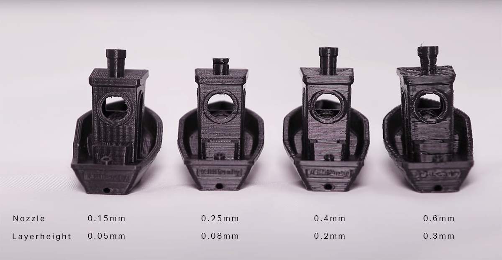

> The different nozzle diameters and their corresponding layerheight. You can clearly see the influence to the printresolution (amount of details in the print) (Source: youtube.com/The3DPrintGeneral)

##### Software Influence

The slicing software prepares your model for printing. It cuts the model in separate layers
and creates the needed internal and external support structures. Most of those calculation
processes are completely automated and the results will be good enough for standard
prints.

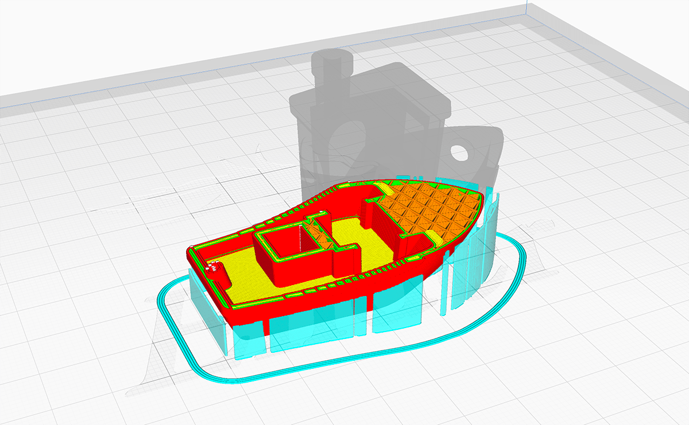

> Preview of a 3d model in a slicing software (cura). You can see the skirt around the model, the infill, the walls and the supportstructure (Source: Chair of Christophe Girot)

*Orientation*

FDM printer stack layer on top of each other. Due to that there is a difference in material
strength parallel to the layer and rectangular to the layer. The layer adhesion is strongest
parallel to the layer.
The orientation effects also the surfaces. Horizontal surfaces look rather different. Keep that
in mind when setting up the orientation of the model before printing.

*Support Structure*

You can safely print overhangs up to 45° with PLA and bridge a layer parallel to the layer up
to 8 mm (depending on nozzle diameter, cooling and print speed). If you need steeper
angles for overhangs or larger gaps in your model, you will need support structures. Those
can be generated with the slicing software and must be removed manually after the print. It
increases the print duration and has also an impact on the surface quality and the
intersection where the support structure connects with the final surface. You can of course
model your own support structure if you want to control where the support is positioned.
Just make a gap from half the layer height between support structure and final surface. This
helps that the filament doesn’t stick too hard to the support structure. Manual support
structure is often needed to get the maximum out of your final print quality, or if you get to
the limits of your software's ability to create automatic support structures.

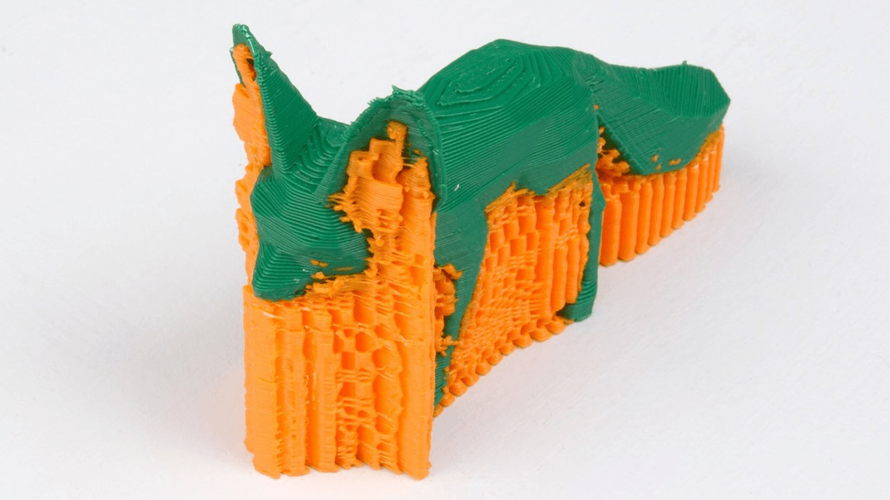

> Complex models with overhangs above 45 degrees need a support structer. Wherever this structer conects the final modelsurface you will see some small spots in the model. (Source: all3dp.com)

*Raft, Skirts and Brims*

These techniques help to hold the print to the printing bed. It reduces warping effects or
indicates in the first layer how the printer is calibrated.

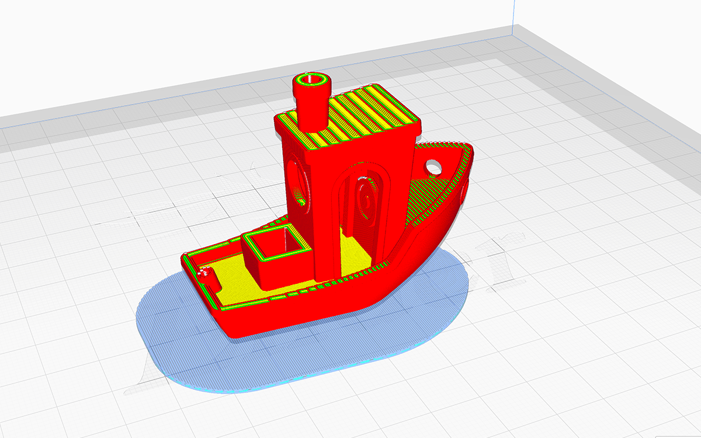

>**Raft** – is often used with ABS and elevates the print from the printing bed and reduces
warping. (Source: Chair of Christophe Girot)

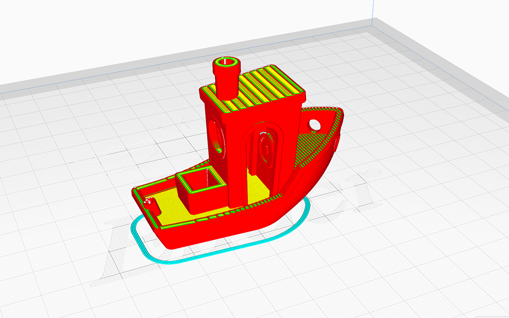

>**Skirt** – is an outline around the printed area on the first layer. It indicates how well the
filament gets extruded and how it sticks to the printing bed. Stop the print if you see an
unclean skirt at the beginning of your print.

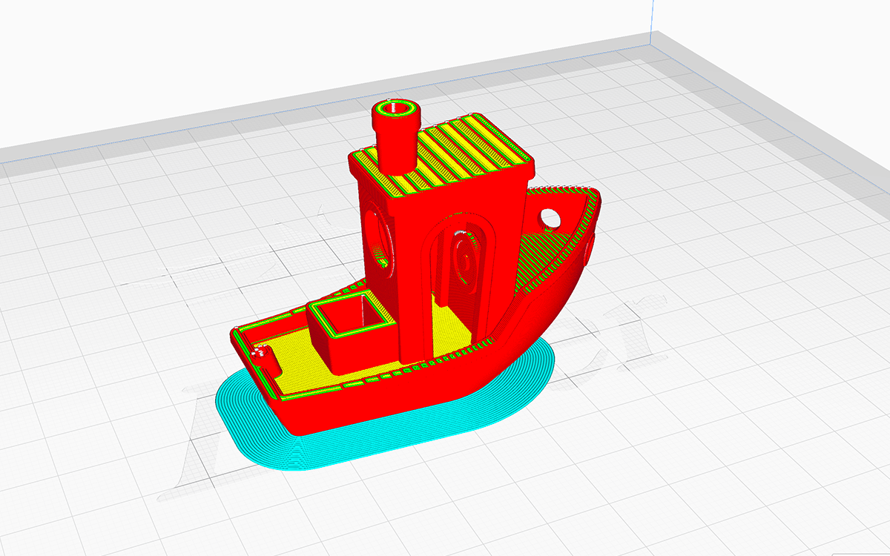

>**Brims** – is also an outline. But directly connected to the base of the print. It helps to increase
the adhesion between print and bed by increasing the base surface of the object. Very
useful if your object has a small footprint. It also helps to keep the corners down (warping).

*Infill*

The amount of infill has an impact on the surface quality top surface, amount of filament
needed, printing speed, and the strength of the model. An infill of 20 % is usually enough for
a mechanically non-demanding print. The crisscross pattern is standard and can be let
untouched in most cases.

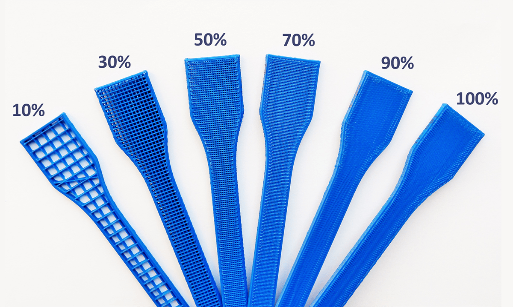

> Infillsettings. 20-30% is enoguh in most cases. A denser infill pattern only increases print time. (Source: 3deee.ch)

*Layer/Layer thickness*

Defines the height of each layer. It corresponds to the nozzle diameter and isn’t freely adjustable. (See nozzle diameter). You can also increase or decrease the number of layers on the top/bottom and the walls. A minimum is two layers. Less will
result in ghosting or poor surface quality due to too less material or support. The layer quantity increases the model strength more than the infill!

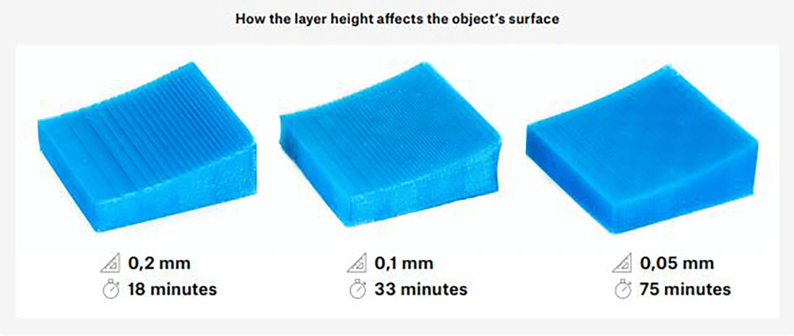

> The layerheight influence the amount of details that can be reproduced as well as the print time (Source: b3d-online.com)

*Preview*

Always have a look at the preview to check if the support is at the right places or to check how the infill was created.

> This example shows that there is support generated around the boat although it isn't needed. There was a wrong option checkd in the slicing software. (Source: Chair of Christophe Girot)

---

### How to print

- [Printing with the Cetus 3D](#Cetus-3D)
- [Printing with the Raise 3D](#Raise 3D)

*File-Preperation*

Your file is key to a good print. Always prepare your model seperatly for 3d printing unless it is already a model for 3d printing from the web. Often it is necessary to remodel your design for the 3d print to get the best result. There are some basic parameters that should always be checkd:

- Is your model a closed volume? or in other words, is it waterthight? Only if every surface is connected to another it is possible to print.
- Is the thinnest point on your model at least once the nozzle size?

If both is yes you can export your model as an **.stl file** (stereolithography file). This is the most common CAD file and is supported by the most 3d modeling program like rhino or fusion.

*Slicing*

The next step is to import your .stl file to the slicing software and generate a gcode. The G-Code is basicly the manual for the printer on how to print your model. It tells it where to move and how much filament it should extrude and so on.

The two FDM printers at the Raplab uses different slicing software.

##### Cetus 3D

> (Source: raplab.arch.ethz.ch)

The following Tutorial as well as some more tips can also be found at: https://raplab.arch.ethz.ch/cetus-3d-printer/

This printers uses the Slicing Software Tiertime and the computer is right next to the printers. After unlocking the machines with your ETH card and start the machine by holding turning the triggerswitch to ON. The printer then boots up and start to calibrate itself.

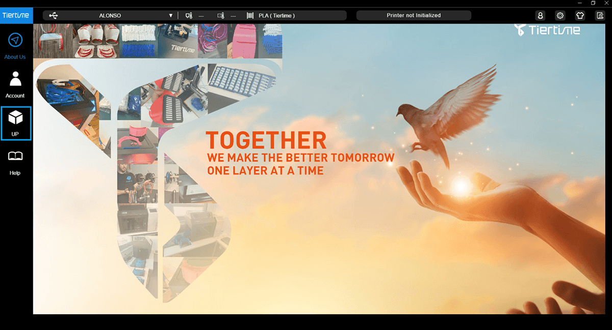

>Open the Tiertime Software on the computer and click on UP in the menu on the left side. (Source: raplab.arch.ethz.ch)

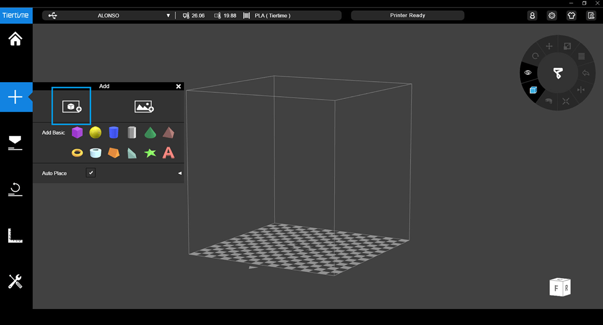

>Import the file by clicking on the big “plus” symbol on the left menubar. In the Submenu choos “add Model” (left icon). After the import you should see your model in the virtual printspace in the middle of the screen. (Source: raplab.arch.ethz.ch)

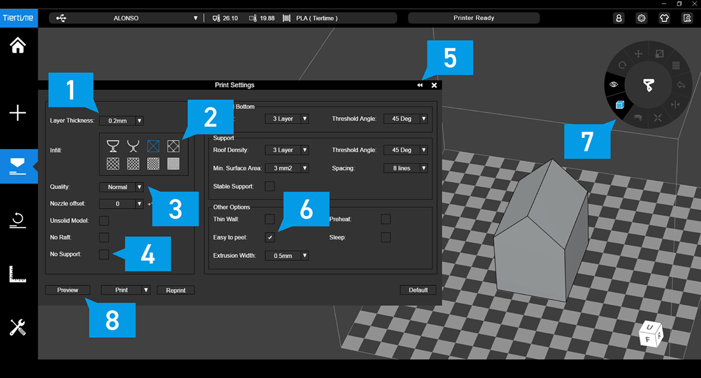

>Then you go to the next menu underneath the “plus”symbol to choos your print settings. You can extend your options by clicking on the arrows in the top right corner (5)
>
>Layer thickness of 0.2 is fine in most cases (1)
Infill between 15-20% is also fine for non structural models (2)
Quality on normal (3)
Choos if you need support or not (4)
And check “easy to peel” (6)
>
>The Top and Bottom option can be left untouched unless you want to get a stronger model
>
>You can also move/scale/rotate your model with the wheel menu on the top right corner of the program (7)
>
>Always preview your print by clicking on “Preview” (8)
>
>(Source: raplab.arch.ethz.ch)

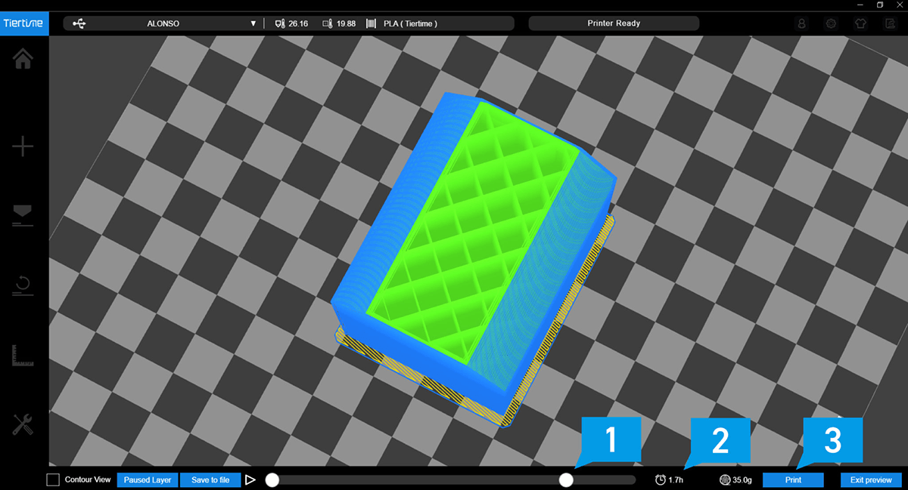

>Check the print sequence (1), the print time (2)
>
>If everything is fine, start your print with “print” (3)
>
>You should check the progress of your print from time to time espacialy the first few layers are crucial for a good print. If the first layer looks uneven or does not stick to the printbed stop the print. And contact the Raplab Staff
>(Source: raplab.arch.ethz.ch)

##### Raise 3D

>(Source: raplab.arch.ethz.ch)

The following Tutorial as well as some more tips can also be found at:
https://raplab.arch.ethz.ch/raise-3d/

The bigger printer use Ideamkaer. Other then the Tiertime software you can download it to your own computer and generate your g-code there. Because you need a own USB stick to transfer it to the printer.
The Process is very similar to the smaller printer.

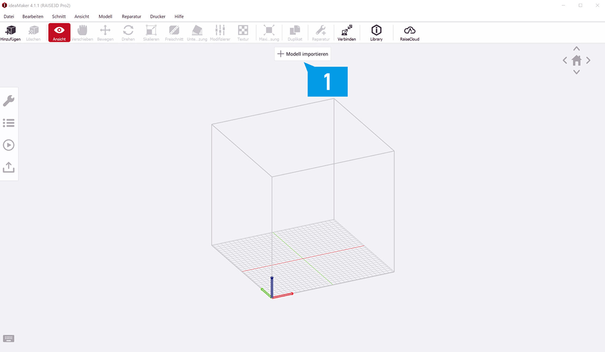

> Open Ideamaker on the computer at the Raplab or your own one. Import the .stl file with the button in the top. (Source: raplab.arch.ethz.ch)

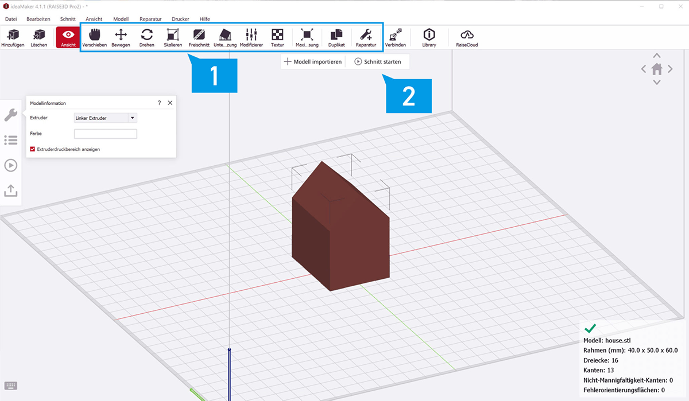

> You can rotate/move/scale your model (1) as well. Befor you start the slicing (2). (Source: raplab.arch.ethz.ch)

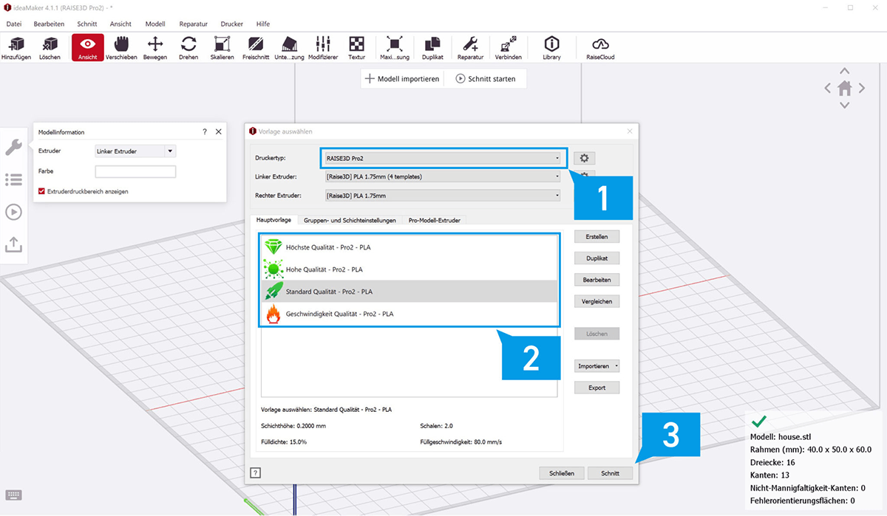

> In the following menu choose the printer in the drop-down list. (1) “Ahonen – Raise3D, Kasai – Raise3D Pro2”. Then Choose the printer settings (2). And start slicing (3).

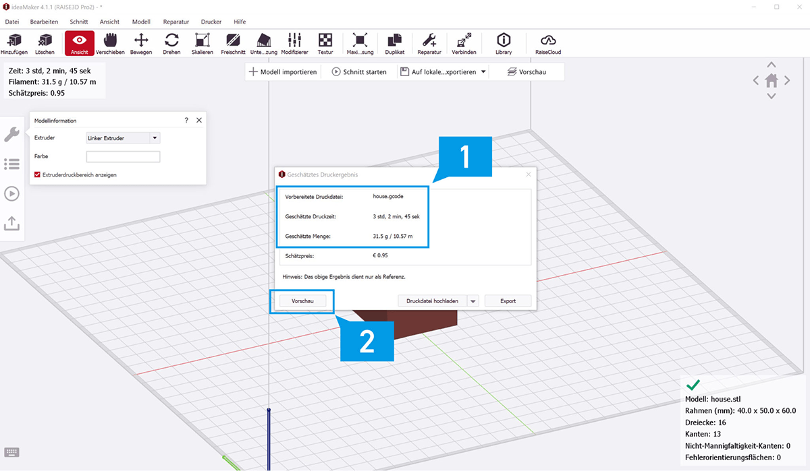

> Check the Print time (1) and preview the slicing (2). (Source: raplab.arch.ethz.ch)

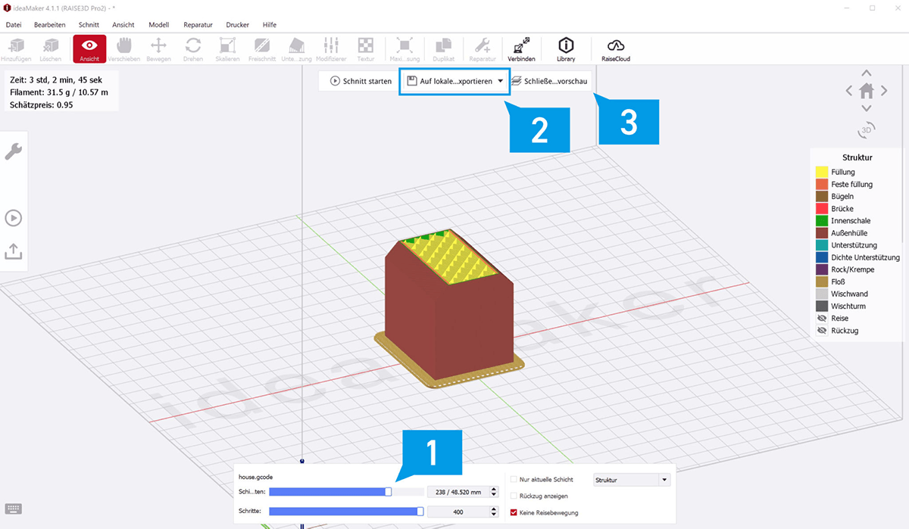

>With the slider in the bottom you can simulate the print time layer for layer(1). If everything is fine save the g-code to your usb stick (2).

Then go to the printer and unlock it with your ETH Card. Connect the usb stick to the printer and go to “file” in the menu. Choose your file and start the print.

---

### Troubleshooting

Following are some of the most common Printer problems:

- The Print loses friction, and the print fails

This is often the case if the print bed isn’t calibrated well. It should have a consistent
distance to the nozzle. Contact the RapLab-Team and they will calibrate the printer for you
in this is the case. If you print with a heated bed, you can increase the bed temperature,
which helps the filament to stick to the bed. Sometimes cleaning the bed or adhesive spray
helps as well. Contact the Raplab team before applying any adhesive to the printing bed.

- Warping

The Edges lift from the ground. This is often the case when you try to print large surfaces
and the temperature difference between top and bottom layer of the filament is too big.
Increase the bed temperature or the printer cooling. Using a “Brim” support in the slicing
software or rotating the model might help as well.

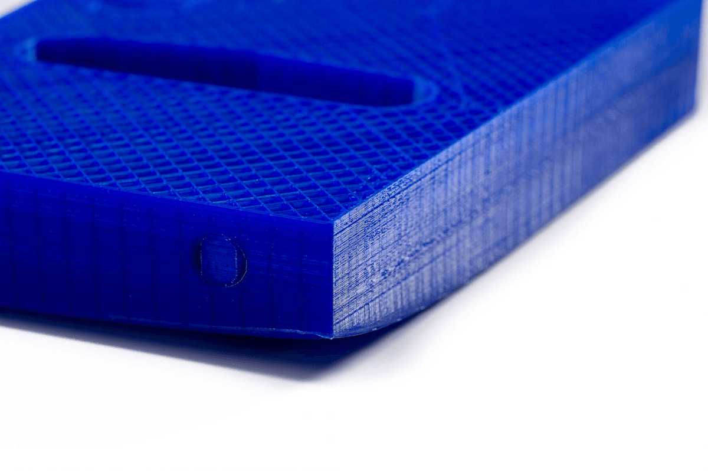

> The Edge lifted off the print bed due to a too high temperature difference from the already printed part to the newest layser. In worst case the print loses friction and fails completly. (Source: Ultimaker.com)

- Ghosting (Visible Support Structure)

To fill the volume, the slicer creates inner walls as a support for a more rigid volume. If the
outer walls are too thin, the inner support walls become visible. Lower the print speed or
increase the wall count of the outer wall to fix this problem.

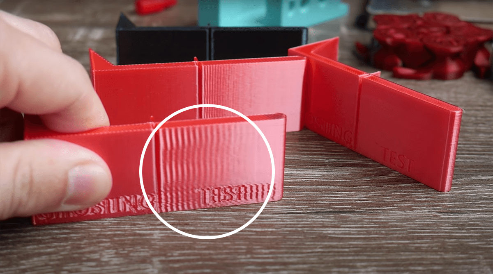

> The visible waves on the surface are infill walls that shine trough the too thine outer wall. (Source:Youtube.com/MakersMuse)
