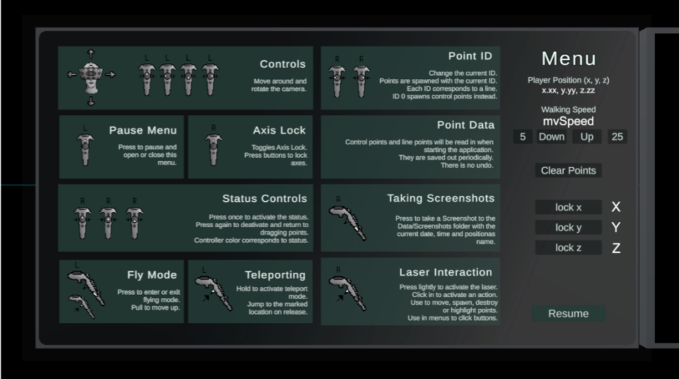
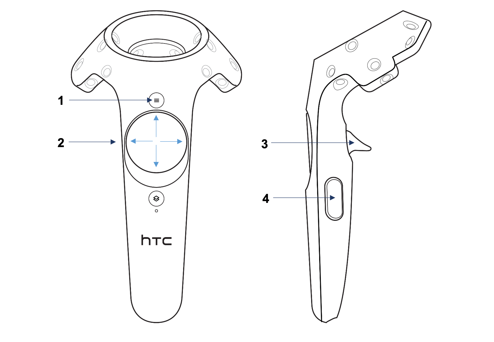
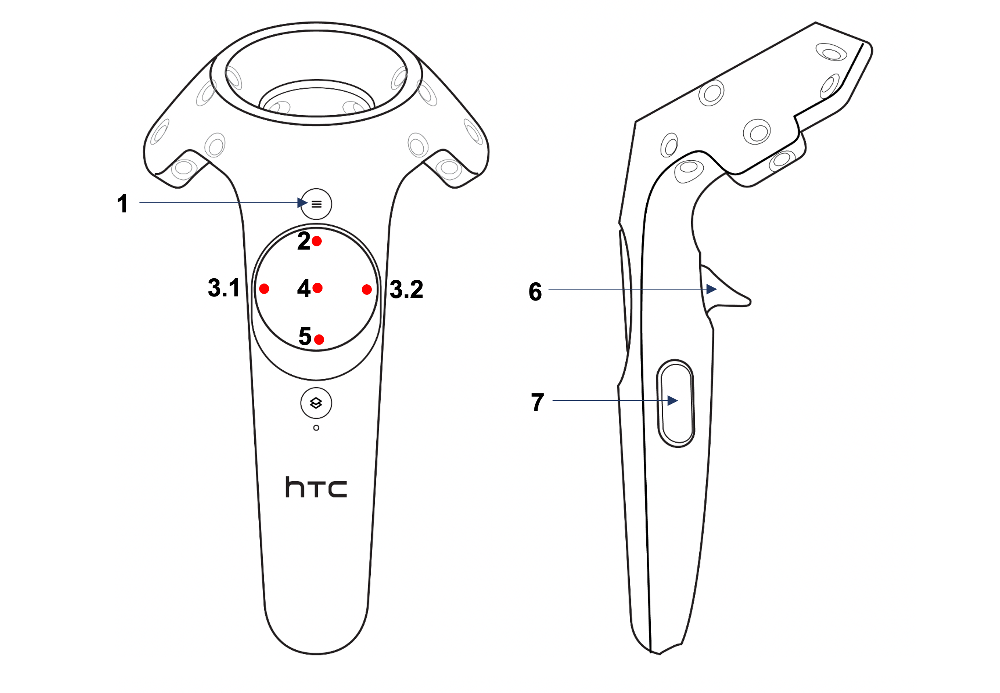

# VR Instructions

To navigate and move in the virtual space you have to use the two VR-Controller.

This menu is showing you start the app. Close it with button 1 of controller I to start the VR app. You can also reopen it anytime with this button
Use the laser of controller 2 to select the speed, clear all points or lock different axis on the right hand site.

### VR-Controller 1 (left hand)

> 1. Open / Close Menu
> 2. Movement with four inputs: Forwards, Backwards, Left and Right. (press the pad in the desired direction)
> 3. Teleport: Hold and press this button to prompt a teleport preview while aiming at the ground. Release the trigger to teleport to the selected location.
> 4. Press both side buttons simultaneously to turn “Flying Mode” on or off. (Flying mode disables “gravity” – therefore you can move upwards)

### VR-Controller 2 (right hand)

> 1. Lock point movement (preset: z-axis – customization in the menu)
> 2. Spawn new point mode (clicking a second time goes back into default mode).
> 3. Increase (3.1) or decrease (3.1) the ID of the object you draw. (ID 0 are single points, ID 1 and higher are polylines)
> 4. Highlight point mode (clicking a second time goes back into default mode).
Use this mode to insert point into lines or find the ID of a line. To do so go into “highlight point mode” and select a point. The app will automatically switch to the correct ID. If you now switch to “spawn point mode” and click with the trigger (6) the app will insert a new point right after the highlighted one.
> 5. Delete point mode (clicking a second time goes back into default mode).
> 6. Trigger to move, spawn, highlight and delete points (depending on mode). Pull trigger slightly to see laser, fully pull trigger to perform action depending on mode.
> 7. Press both side buttons simultaneously to turn take a screenshot. (Takes a screenshot of the left eye – and saves it automatically in the Unity data folder)
