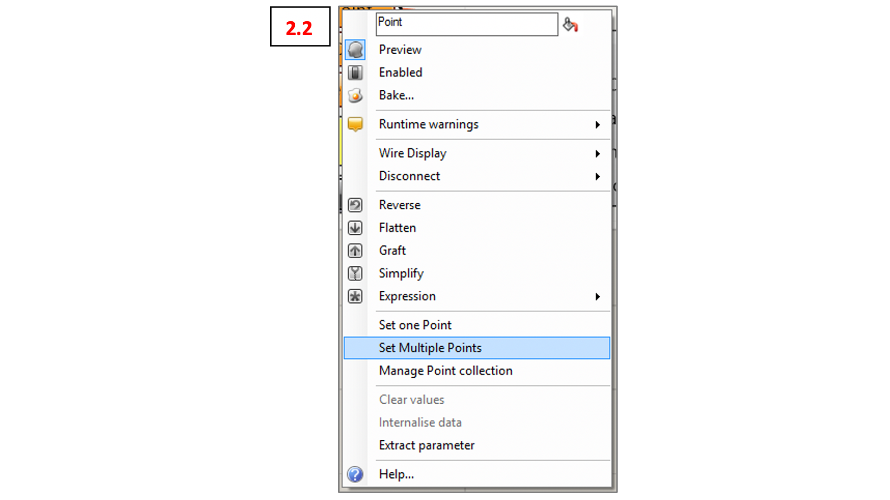

# Rhino to VR

### Export of Lines and Curves to VR from Rhino

Use the following Grasshopper-Script to export the lines from Rhino: "220301_VR_LstExport_ImportFile.gh"

Inside of Grasshopper you should see the Cluster "txt_Export" as shown in the following image 2.1

Right-click the “Point” component to connect the points from Rhino to Grasshopper (see 2.2).
Repeat for the “Curve” Component.

>HINT: If you select the points/Curves before doing this step they will be loaded directly. Helpful if you have all relevant objects on one layer.

Also right-click on the “File Path” Component and now klick “Select a Directory”
(see 2.3).
You are now choosing the location (folder) where Grasshopper will save the .txt file.After all components are grey and you are happy with the file name hit the “Button”. You will now find the
exported file in the location you set up before.

Note: **Grasshopper will overwrite your file if you press the button with the same file name again**. If you wish to save several files adjust the file name accordingly.
The exporter is only working with polylines. If you want to export smooth spline curves rebuild them into finely segmented polylines before feeding them into the “Curve” component

### Getting Lines and Curves to Unity + VR

Change the file name into “data_points.xyz”. Confirm the pop-up window afterwards.

Once you switch over to the PCs in the LVML you will find the following folders on the desktop: "VR_Pointcloud", "VR_Studio" and a shortcut "Data – Put XYZ File here". You can Drag & Drop your XYZ inside here.

Replace the file below with your own file.

Start the Unity Hub as usual. You should find the Points and Lines at their exact location in the point cloud model.

Note: Whenever you replace the data_points.xyz file and Unity is already running, you just need to restart the game instance. (By pressing the “Play” button to start and stop the game instance)

### Export of Lines and Curves to Rhino

To get your design inputs out of Unity copy the “data_points.xyz” file from the “Data” Folder
(see 3.1 above)

NOTE: Wait at least 10 seconds after the last input (eg. Point spawn, point drag, delete etc.) before copying the data_points.xyz file.

Give the file a .txt file ending.

Back to the following Grasshopper-Script to import the lines to Rhino: "220301_VR_LstExport_ImportFile.gh"
Use the txt_Import cluster to get the points and lines back into Rhino.
(3.1)

Connect the file by right-clicking the “File Path” component and “Select one existing file”. (3.2)
Afterwards all components should turn grey.

Now just bake the contents of the “Curve” and “Point” components on layers of your desire.
(3.3)

