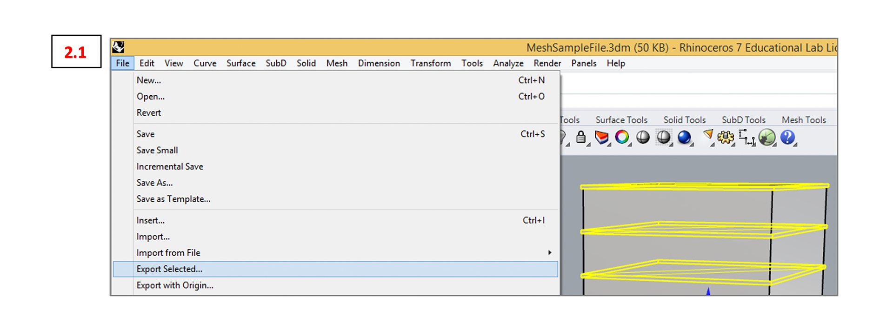
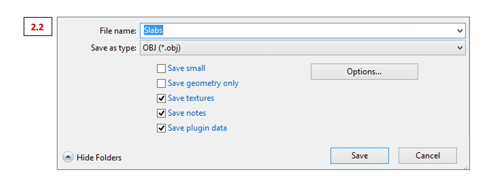
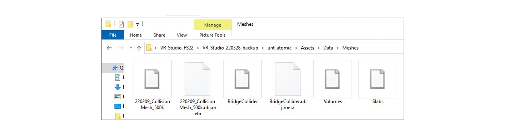
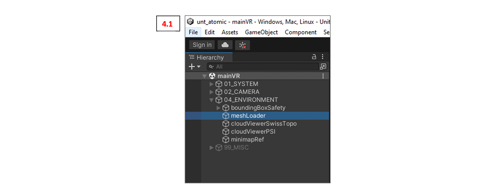
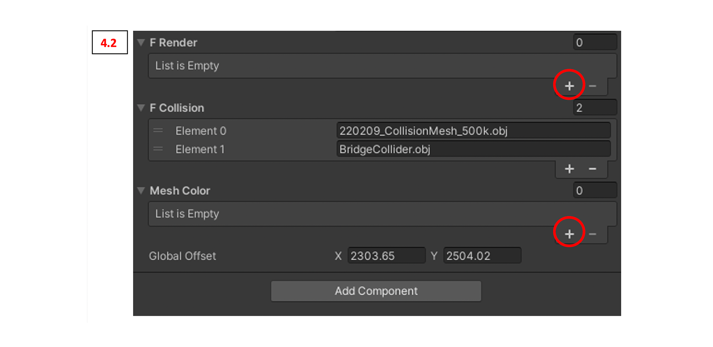
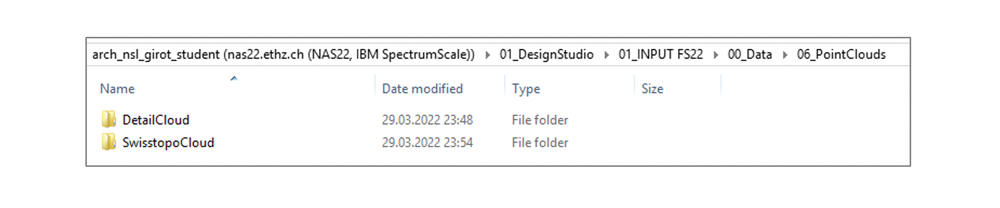
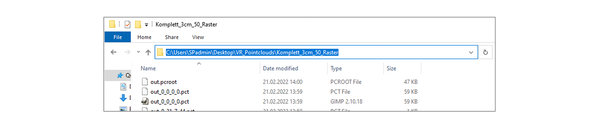
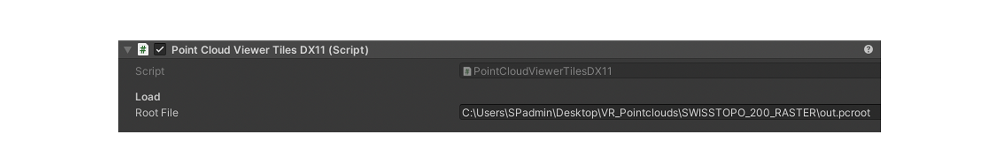

# Mesh to VR

### Meshes from Rhino to Unity + VR

Generate building volumes / pieces of topography etc. as meshes. To convert surfaces to meshes select the surfaces you would like to convert into meshes and type “_Mesh”.
Every piece of mesh model that you would like to be colored the same in Unity has to be joined together into one mesh. Do so by selecting all the meshes to join and type “_Join”.

HINT: It has proven helpful to illustrate the scale of buildings by adding slabs as shown in the picture below (1.1). Find the Mesh sample file containing those meshes in the Bootcamp 6 folder.

To feed the meshes to Unity we need to export them separately as .obj files. To do so first select the mesh to export then go to File -> Export Selected…  (see 2.1)

Give the file a name and select OBJ (.obj) as the desired file format (2.2).

In the following export dialogue go to “Formatting” and uncheck the box “Map Rhino Z to OBJ Y”
(see 2.3)

Rhino will afterwards create a bunch of different files. The only one we are interested in is the one with the ending .obj. You can delete the other ones.
(see 2.4)

Now we have to take the .obj files over to Unity and VR. First we have to put the .obj files in the right location (Data -> Meshes):

To visualize the meshes we have to dive a bit into the structure of Unity. So here is a quick summary of the interface:

>1. Game Instance Controls (“Play” button starts and stops the VR instance) **Note: Any changes made within Unity while the VR instance is running will be discarded once the instance stops. So make sure the instance is not running while making changes.**
>2. This area is called “Hierarchy”. This is where Unity displays its game objects.
>3. The “Inspector” allows you to adjust selected game objects.

To visualize the meshes we need to first navigate to “meshLoader” in the Hierarchy. Once you have found it klick it and switch over to the Inspector.
(see 4.1)

The Inspector will look something like this (see 4.2).
As we look forward to render two new meshes in Unity we need to add two “F Render” slots and
“Mesh Color” slots. Just click the plus.

After adding the slots we need to fill them correctly.
For the “F Render” slots: Put the exact names of the .obj files including the .obj ending.

**Note**: Any typo and Unity will not find the mesh.
For the “Mesh Color” slots: Pick the colors you want your meshes to have. Either click in the empty black spot and pick a color or select the pipette and click on a color of your liking.

**Hint**: The logic for the relation of meshes and colors is as follows: The first mesh (element 0) from “F Render” will get the first color (element 0) from “Mesh Color”. The second mesh will get the second color etc.

Now you can start the VR instance and if everything went well you will be able to see the meshes in VR.

### Point Cloud Modeling & Point Cloud Updates in VR

Your new meshes might land in the existing point cloud. Therefore we need to be able to adjust the underlying cloud.
Find the point clouds here on the server (ideally you copy them once to your D: drive in the LVML – even though the PCs in the LVML are rather slow they are really good with point clouds):

The point clouds are structured into the rough “SwisstopoCloud” (changes to this cloud can be very rudimentary) and the “DetailCloud” split into East and West for smaller file sizes.

Most point cloud modeling will take place in CloudCompare, a free software installed on all LVML PCs. For a quick guide visit the chair’s Github page:

[CloudCompare Basics](03_Cloudcompare_Tutorial.md)

We will be mostly using the “Section tool” – the little scissors in the middle of the toolbar:

The goal for your first modifications is to cut out the parts where your interventions come in.

After the cutting is done: Select the modified cloud in the DB tree (left layer menu) and click on the save button above. Save the cloud as a ".las" file. This is absolutely necessary for the next step. No other format will work.

**Hint**: For your own backup either save the whole CloudCompare file as a native ".bin" format or ".e57" file. The performance of those formats is a lot better.

Next we have to create two folders: One for the transformed detail clouds and one for the transformed Swisstopo cloud.
The content of each folder should be as follows:

>**Detail Cloud Folder**:
- ExportEAST.las
- ExportWEST.las
- ReferenceCloud.las

>**Swisstopo Cloud Folder**:
>
>- ExportSWISSTOPO.las
>- ReferenceCloud.las

The reference cloud will make sure the point clouds land in the correct position in Unity.

The next step is to transform the .las cloud into a Unity-readable format. This step need a tiny new program: The PointCloud Converter v1.74.
You find it here on the server *01_INPUT FS22\05_Digital Bootcamps\Bootcamp 6*. **Copy the whole folder to the D: drive.**

Open the folder and double-click the .exe file.

The following window will pop up. Fill in all information as shown on the image below (4.1). For “Input” select the whole “Detail Cloud” or “Swisstopo Cloud” (change “Grid size:” to 200 for the Swisstopo cloud) folder we created in the step before.
Choose an empty folder as output location and name the file “out.pcroot”.

**Note**: The converter will create thousands of files. You really don not want to have them on the desktop

**Important Note**: Always open and close the PointCloud Converter Window before when you pan on converting several clouds in a row. Clouds after the first one will be corrupted if you do not do that – seems to be a weird bug.

To bring the clouds into Unity we have to bring converted clouds to the AV Lab PCs and link them correctly.
Copy the folder with the clouds somewhere to the desktop and label them with your group name.

Copy the file path (marked in blue above) of your cloud’s location.

Now open the Unity Hub and start the app as usual. Navigate to the “cloudViewerPSI” and “cloudViewerSwissTopo” in the Unity Hierarchy as shown below. Select on of them and switch over to the Inspector panel.

You should see a field called “Root File”. Paste the path of your personalized cloud here to replace the existing link.

Add **\out.pcroot** in the end of the file path.

If everything went well you can now start the VR instance and will find your new clouds embedded.
