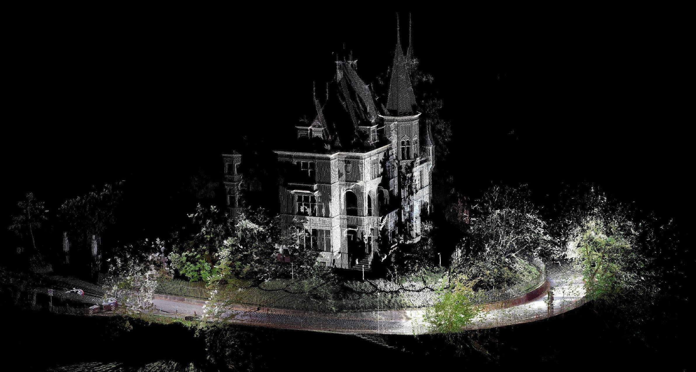
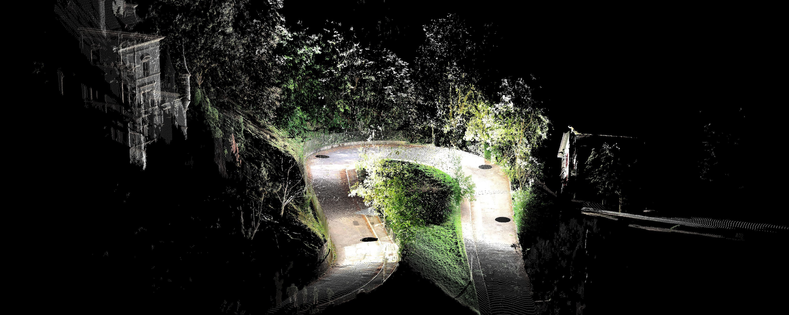
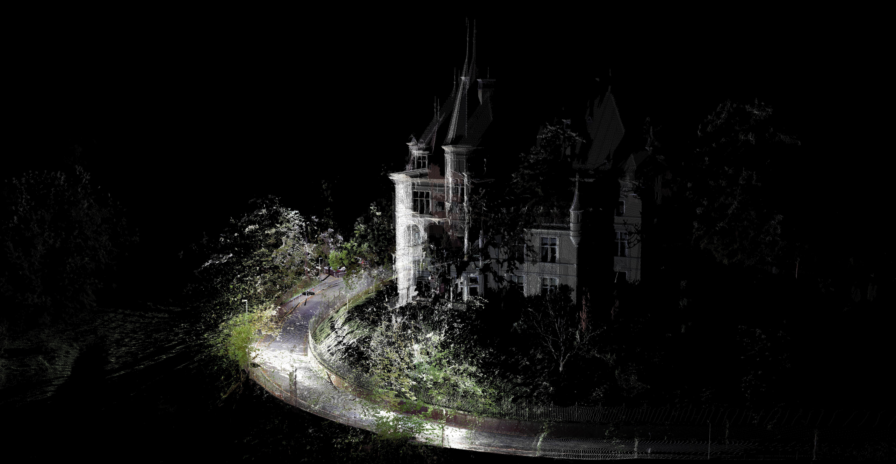

# Digital Design Methods

This course covers the essential digital tools for contemporary landscape architects. Contents include basic techniques of data collection, transformation and modelling as well as methods for visualisation and verification of designs.

The first semester introduces methods for site mapping like terrestrial laser scanning and photogrammetry, analysis and data processing software like Autodesk ReCap and CloudCompare as well as modelling and fabrication tools such as Rhinoceros 3D, Grasshopper for Rhino and RhinoCam.

The second semester focuses on the integration of sensing and GIS tools into a topographical three-dimensional modelling workflow.

The third semester aims at integrating the tools and methods into a studio design.

## Digital Design Methods 1

##### Timetable

- [**Week 01** (27.09.21) - Kickoff Session](Timetable_DDM_I/Week_01.md)
- [**Week 02** (04.10.21) - Terrestrial Laser Scanning](Timetable_DDM_I/Week_02.md)
- [**Week 03** (11.10.21) - UAVs and Photogrammetry](Timetable_DDM_I/Week_03.md)
- [**Week 04** (18.10.21) - Autodesk Recap and CloudCompare](Timetable_DDM_I/Week_04.md)
- **Week 05** (25.10.21) - Seminarweek
- [**Week 06** (01.11.21) - CloudCompare](Timetable_DDM_I/Week_06.md)
- [**Week 07** (08.11.21) - Rhinoceros](Timetable_DDM_I/Week_07.md)
- [**Week 08** (15.11.21) - Rhinoceros - Advanced Modelling](Timetable_DDM_I/Week_08.md)
- [**Week 09** (22.11.21) - Rhinoceros - Grasshopper](Timetable_DDM_I/Week_09.md)
- [**Week 10** (29.11.21) - Rhinoceros 3D Modelling - Rhino Cam](Timetable_DDM_I/Week_10.md)
- [**Week 11** (06.12.21) - Milling](Timetable_DDM_I/Week_11.md)
- [**Week 12** (13.12.21) - Presentation of Final Results](Timetable_DDM_I/Week_12.md)

## Digital Design Methods 2

##### Timetable

- [**Week 01** (28.02.22) LVML - Introduction and text discussion](Timetable_DDM_II/Week_01.md)
- **Week 02** (07.03.22) LVML - Geopositioning by Benedikt Kowalewski
- **Week 03** (14.03.22) LVML - Sensing Landscapes by Benedikt Kowalewski
- **Week 04** (21.03.22) No Class (Seminarweek)
- [**Week 05** (28.03.22) Online - Data Analysis and Transformations By James Melsom](Timetable_DDM_II/Week_05.md)
- [**Week 06** (04.04.22) LVML - Interoperability GIS with Rhino and Docofossor](Timetable_DDM_II/Week_06.md)
- **Week 07** (11.04.22) Online - Introduction to the Design Challenge
- **Week 08** (18.04.22) No Class (Easter)
- **Week 09** (25.04.22) No Class (Sechseläuten) 
- **Week 10** (02.05.22) LVML - Computational Visualization
- **Week 11** (09.05.22) Online - Design Challenge Support
- **Week 12** (16.05.22) LVML - Design Challenge Support
- **Week 13** (23.05.22) LVML - Final Presentation and Discussion

---

##### Quicklinks

- [How to Connect to the Server](06_Serveracesstutorial.md)
<!-- [History of the Site](00_History_of_the_Site.md) -->
- [Overview Terrestrial Laser Scanning](13_Terrestrial_Laser_Scanning.md)
- [Rhino Basics](01_Rhino_Tutorial.md)
- [Rhino Basic Commands](02_Rhino_Basic_Commands.md)
- [CloudCompare Basics](03_Cloudcompare_Tutorial.md)
- [ReCAP Pointcloud](04_ReCAP_Tutorial.md)
- [Photogrammetry](05_Photogrammetry.md)
- [MultiCam Tutorial](09_MultiCam_Tutorial.md)
- [RhinoCam Tutorial](10_RhinoCam_Tutorial.md)
- [Rhino Grasshopper - Getting Started](08_Grasshopper.md)
- [Rhino Grasshopper - Beginners Guide](08.1_Grasshopper_mz.md)
- [QGIS - DTM to 3D Topography](11_QGIS_Topography.md)
- [Rhino Grasshopper Tips & Tricks](12_Rhino_Grasshopper_Tips_and_Tricks.md)

---

> Authors
> * [Benedikt Kowalewski](https://dfab.ch/people/benedikt-kowalewski-2) / kowalewski@arch.ethz.ch / Chair of Landscape Architecture / Professor Christophe Girot / ETH Zurich
> * [Ilmar Hurkxkens](https://ilmarhurkxkens.com/) / hurkxkens@arch.ethz.ch / Chair of Landscape Architecture / Professor Christophe Girot / ETH Zurich
> * [Zhao Ma](https://beyond-disciplines.com) / ma@arch.ethz.ch / Chair of Landscape Architecture / Professor Teresa Galí-Izard / ETH Zurich
> * [Dennis Häusler](https://girot.arch.ethz.ch/?team=dennis-hausler) / haeusler@arch.ethz.ch / Chair of Landscape Architecture / Professor Christophe Girot / ETH Zurich
> * Philip Meile / phmeile@student.ethz.ch / Hilfsassistenz
> * Michael Zuber  / mzuber@student.ethz.ch / Hilfsassistenz
